# RollupX System Architecture Documentation

## Part 1 — Codebase-Based System Summary

### System Overview
RollupX is an experimental, modular ZK-Rollup prototype. It implements a layered architecture starting from user transaction generation, moving through sequencing and execution, simulating a cryptographic proof stage, and finally submitting state updates to an Ethereum Layer 1 (L1) bridge via smart contracts. 

The system relies heavily on Domain-Driven Design (DDD) principles in its Rust-based microservices (Sequencer, Submitter) and includes extensive testing, benchmarking, and data visualization tools to evaluate different rollup configurations (such as First-Come-First-Served vs. Time-Boost scheduling, and Calldata vs. EIP-4844 Blob Data Availability).

### Detected Components & Implementation Status

1. **UI (zk-rollup-ui)**
   - **Responsibility:** Provide a frontend to deposit, transfer, withdraw, and inspect L2 state.
   - **Status:** **Partially implemented / Minimal.** Contains a `README.md` describing it as a "Minimal dApp", but full source code is not present in the main source tree (`src/` is missing).

2. **Workload Generator / Benchmark Suite (`benchmark-suite/`)**
   - **Responsibility:** Orchestrate controlled experiments by generating synthetic traffic via Poisson processes (`poisson_generator.py`), varying transaction types, and configuring sequencer/prover behaviors.
   - **Status:** **Real / Fully Implemented.**

3. **Sequencer (`sequencer/`)**
   - **Responsibility:** Ingest transactions via JSON-RPC, validate them against a pessimistic state cache, and batch them based on size, timeout, or forced L1 triggers. It includes swappable scheduling policies (FCFS, Fee Priority, Time-Boost, Fair BFT).
   - **Status:** **Real / Fully Implemented.**

4. **Executor (`executor/`)**
   - **Responsibility:** Receive sealed batches from the Sequencer via gRPC, apply state transitions using a VM, and produce outputs containing root hashes and witness metadata.
   - **Status:** **Real / Fully Implemented.** 

5. **Prover Subsystem (`Zk-Prover/`, `submitter/src/infrastructure/prover_mock.rs`)**
   - **Responsibility:** Generate Zero-Knowledge proofs for the executed batches.
   - **Status:** **Mocked / Stubbed.** The system heavily simulates this stage. `submitter` uses `MockProofProvider` that waits a configured delay and returns a zero-padded string, or an `HttpProofProvider` that talks to a mocked endpoint. The `Zk-Prover` directory contains a `dummy_prover.rs`. There is no real cryptographic proving backend currently hooked up to the main flow.

6. **Submitter (`submitter/`)**
   - **Responsibility:** Ingest finalized executor batches and submit them to the Ethereum L1 bridge. It handles DA (Data Availability) via Calldata or EIP-4844 blobs, maintains an internal SQLite/Postgres database for retry loops and idempotency, and uses a Saga workflow.
   - **Status:** **Real / Fully Implemented.**

7. **Smart Contracts (`contracts/`)**
   - **Responsibility:** Act as the L1 settlement layer. Includes the `ZKRollupBridge` which orchestrates validation, and distinct DA providers (e.g., `BlobDA`).
   - **Status:** **Real / Fully Implemented.** 

8. **Data Tools (`data-tools/`)**
   - **Responsibility:** Consume JSON/CSV metrics from the benchmark suite to compute statistics and plot Pareto frontiers, throughput bars, and latency CDFs.
   - **Status:** **Real / Fully Implemented.**

---

## Part 2 — End-to-End Architecture Diagrams

### 1. E2E Abstract Architecture

**Purpose**
Provides a high-level overview of the major RollupX components and the general flow of data from transaction generation to L1 settlement.

**Evidence from code**
- `benchmark-suite/poisson_generator.py`
- `sequencer/src/main.rs`
- `executor/src/bridge.rs`
- `submitter/src/submitter.rs`
- `submitter/src/infrastructure/prover_mock.rs`
- `contracts/contracts/bridge/ZKRollupBridge.sol`
- `data-tools/aggregate.py`

**Mermaid Diagram**
```mermaid
flowchart LR
    UI[UI Frontend\n(Minimal)] --> SEQ
    WG[Workload Generator\n/ Benchmark Suite] -->|Synthetic Tx Load| SEQ

    subgraph Rollup_L2 [Rollup L2 Node]
        SEQ[Sequencer] -->|Sealed Batch| EXEC[Executor]
        EXEC -->|Root/Witness| PROV[Mocked Prover\n(Simulated Delay)]
        PROV -->|Mock Proof| SUB[Submitter]
    end

    SUB -->|DA & Proof| L1[Ethereum L1 / Local Hardhat]
    L1 -.->|L1 Events| SEQ

    WG -.->|Metrics| DT[Data Tools / Analytics]
    SEQ -.->|Metrics| DT
    EXEC -.->|Metrics| DT
    SUB -.->|Metrics| DT
```

**Explanation**
- The **Workload Generator** creates transactions using a Poisson process and feeds them to the **Sequencer**.
- The **Sequencer** batches transactions and pushes them to the **Executor**.
- The **Executor** processes state transitions and generates witness metadata.
- The **Mocked Prover** (in reality, just a delay and zero-padded string returned by `MockProofProvider` or `dummy_prover`) "generates" a proof.
- The **Submitter** ingests the proof and batch data, handles DA format, and pushes the data to the **L1**.
- **Data Tools** aggregates metrics output by all components.

**Key assumptions / limitations**
- The UI is marked minimal/partially implemented.
- The Prover is entirely mocked/stubbed.

---

### 2. E2E Detailed Architecture

**Purpose**
Shows the specific technical communication paths, protocols, and data artifacts exchanged between components in a full runtime environment.

**Evidence from code**
- `benchmark-suite/workload/poisson_generator.py` (JSON-RPC load generation)
- `sequencer/src/api/server.rs` (JSON-RPC `sendTransaction`)
- `sequencer/proto/rollup.proto` (`PublishBatch` gRPC)
- `submitter/src/infrastructure/prover_http.rs` (HTTP `POST /prove`)
- `contracts/scripts/deploy-local.ts` (Contract deployments)

**Mermaid Diagram**
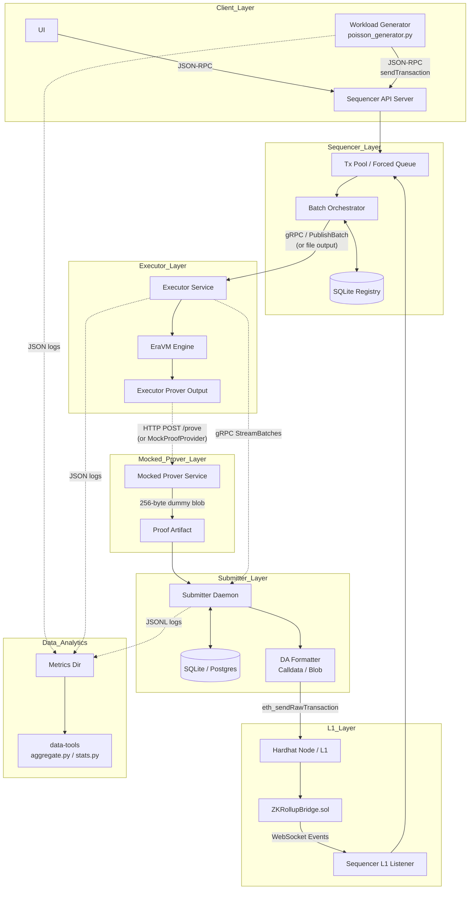

**Explanation**
- Traffic enters the Sequencer via HTTP JSON-RPC.
- The Sequencer persists metadata to an internal SQLite database and sends the payload to the Executor via gRPC (or file-based legacy bridge).
- The Submitter streams batches, queries the mocked HTTP prover (or uses an internal mock provider) for a dummy proof, stores its state in Postgres/SQLite, and interacts with the L1 Node via standard Ethereum RPC calls.
- The Sequencer listens to L1 via WebSockets for priority forced transactions.

**Key assumptions / limitations**
- The Prover HTTP call returns a fixed mock string.

---

### 3. E2E Sequence Diagram

**Purpose**
Illustrates the chronological end-to-end execution flow of a transaction, from generation to settlement on L1.

**Evidence from code**
- `benchmark-suite/workload/poisson_generator.py`
- `sequencer/src/batch/orchestrator.rs`
- `submitter/src/infrastructure/prover_mock.rs`
- `contracts/contracts/bridge/ZKRollupBridge.sol`

**Mermaid Diagram**
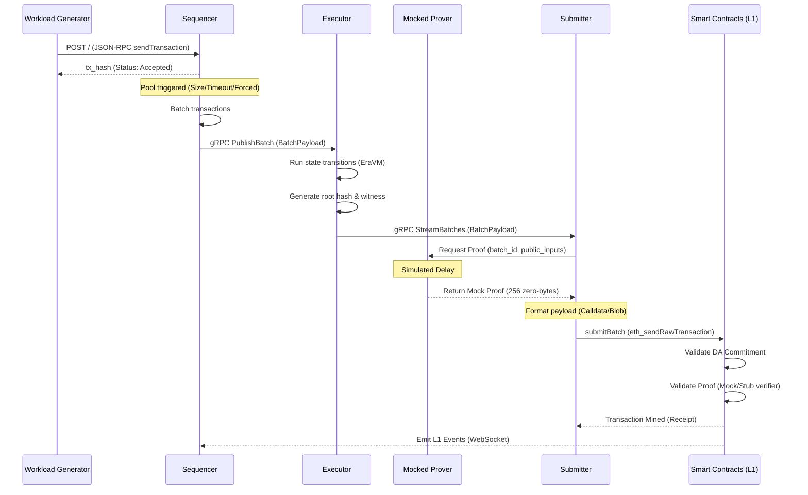

**Explanation**
- The process is entirely asynchronous. The Workload Generator fires and forgets HTTP requests. 
- The Sequencer acknowledges transaction receipt immediately (optimistic acceptance), but delays execution until the batch triggers.
- The Executor processes the state synchronously inside a batch boundary and exposes a stream.
- The Submitter pulls the stream, requests a mock proof, waits out the simulated delay, then submits everything to the blockchain.

**Key assumptions / limitations**
- The validation on L1 relies on `MockVerifier.sol` matching the mock proof data.

## Part 3 — Per-Component Architecture Diagrams

### UI Component
*(Note: Codebase analysis shows the UI is a minimal, partially implemented stub. `zk-rollup-ui/` lacks source files, only a README exists).*

#### UI Abstract Architecture
**Purpose:** Show intended UI boundaries.
**Evidence from code:** `zk-rollup-ui/README.md`
**Mermaid Diagram:**
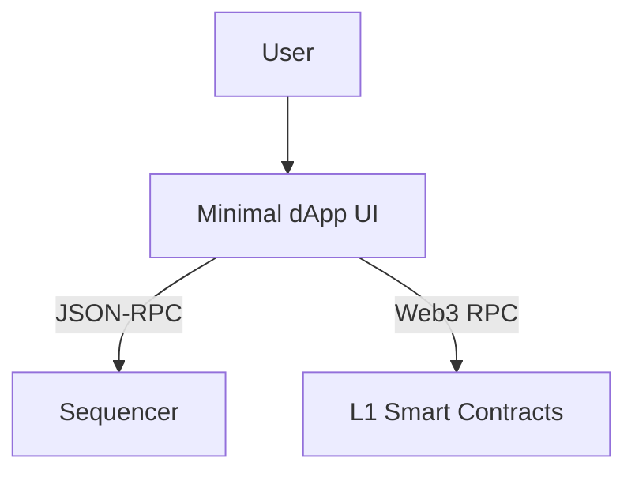
**Explanation:** The UI is intended to send transactions to the Sequencer and read L1 state for deposits/withdrawals.
**Key assumptions:** Component is essentially a placeholder in the current repository state.

---

### Workload Generator / Benchmark Suite

#### Workload Generator Abstract Architecture
**Purpose:** Show how the workload generator orchestrates tests.
**Evidence from code:** `benchmark-suite/README.md`, `benchmark-suite/poisson_generator.py`
**Mermaid Diagram:**
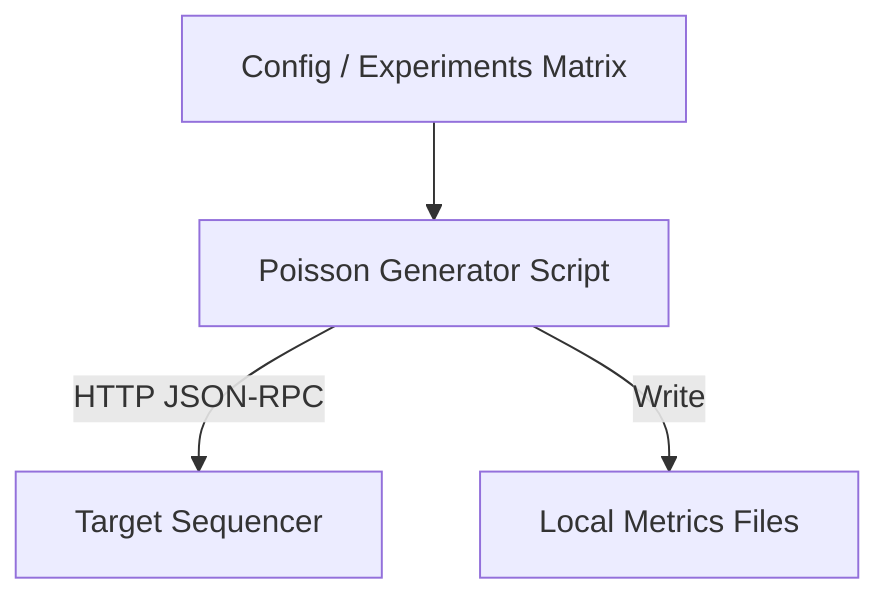
**Explanation:** The generator reads experiment configurations, blasts the Sequencer with synthetic HTTP traffic based on a Poisson distribution, and dumps the resulting telemetry into a local JSON file.

#### Workload Generator Detailed Architecture
**Purpose:** Detail internal modules of the workload generator.
**Evidence from code:** `benchmark-suite/workload/poisson_generator.py`
**Mermaid Diagram:**
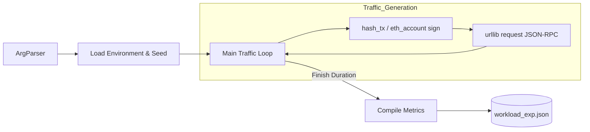
**Explanation:** A synchronous python loop generates ECDSA-signed mock Ethereum transactions and sends them sequentially/concurrently via HTTP, calculating throughput and latency.

#### Workload Generator Sequence Diagram
**Purpose:** Runtime behavior of the generator.
**Evidence from code:** `benchmark-suite/workload/poisson_generator.py`
**Mermaid Diagram:**
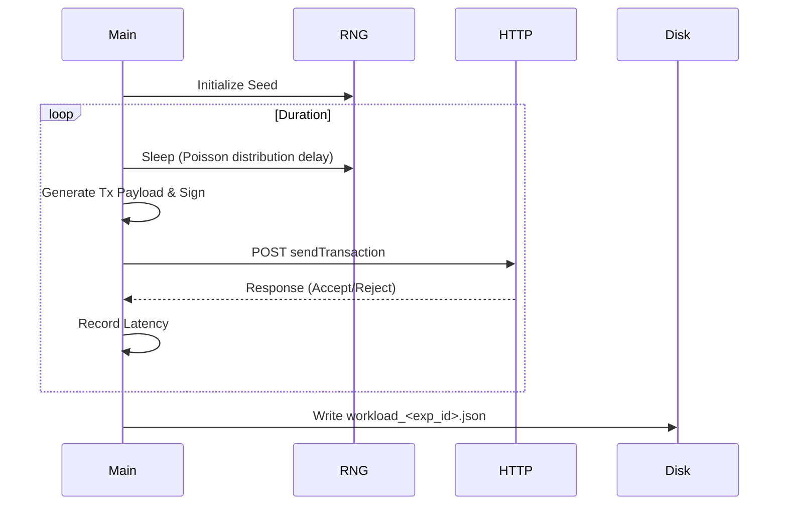
**Explanation:** The core loop sleeps based on a mathematical distribution to simulate real-world arrival times before dispatching requests.

---

### Sequencer

#### Sequencer Abstract Architecture
**Purpose:** High-level view of Sequencer responsibilities.
**Evidence from code:** `sequencer/src/main.rs`, `sequencer/README.md`
**Mermaid Diagram:**
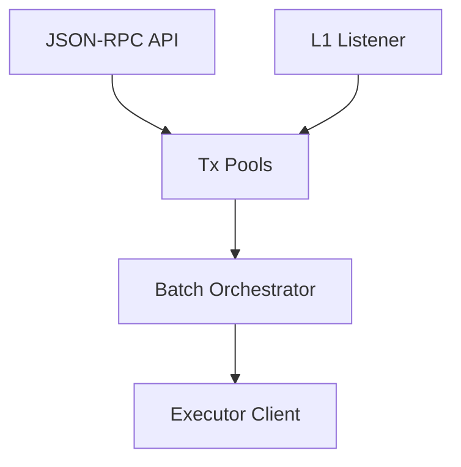
**Explanation:** The Sequencer ingests from users and L1, queues them, orders them via a scheduler, and dispatches batches to the Executor.

#### Sequencer Detailed Architecture
**Purpose:** Internal breakdown of the Sequencer.
**Evidence from code:** `sequencer/src/main.rs`, `sequencer/src/pool/`, `sequencer/src/scheduler/`
**Mermaid Diagram:**
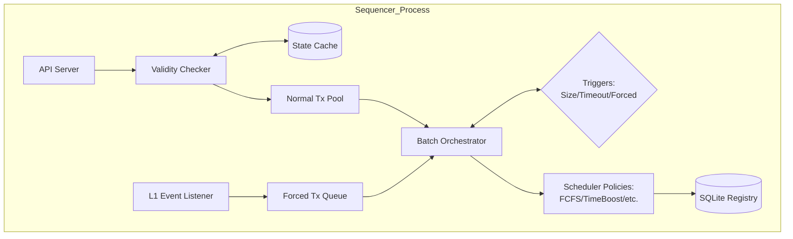
**Explanation:** The Validty Checker strictly uses pessimistic balance tracking against the State Cache. Triggers dictate when the Orchestrator pulls from the queues and applies the active Strategy pattern scheduling policy.

#### Sequencer Sequence Diagram
**Purpose:** Transaction lifecycle inside the Sequencer.
**Evidence from code:** `sequencer/src/main.rs`
**Mermaid Diagram:**
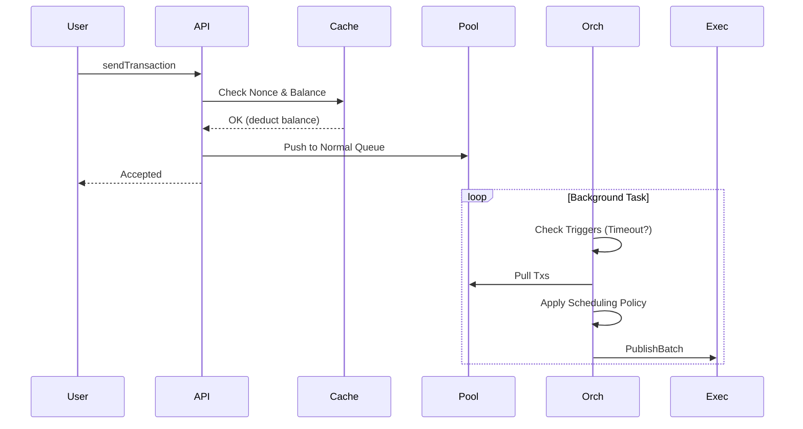
**Explanation:** User interaction is isolated from batch creation. Validation is instantaneous, while batching happens asynchronously.

---

### Executor

#### Executor Abstract Architecture
**Purpose:** High-level state transition layer.
**Evidence from code:** `executor/SYSTEM_DESIGN.md`
**Mermaid Diagram:**
```mermaid
flowchart TD
    SEQ[Sequencer] --> IN[Bridge / gRPC Receiver]
    IN --> MACH[State Machine (EraVM)]
    MACH --> TREE[Merkle Tree Processor]
    TREE --> OUT[Batch Output / Stream]
```
**Explanation:** The Executor takes raw transactions, processes them via a VM, updates the state tree, and returns cryptographic proofs of execution (witness/root hashes).

#### Executor Detailed Architecture
**Purpose:** File-level module breakdown.
**Evidence from code:** `executor/src/bridge.rs`, `executor/src/executor.rs`
**Mermaid Diagram:**
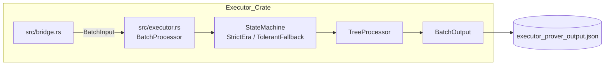
**Explanation:** `bridge.rs` ingests data and loads artifacts. `executor.rs` handles the execution. It can fall back to TolerantResearch mode if VM execution fails strict prerequisites.

#### Executor Sequence Diagram
**Purpose:** Internal execution loop.
**Evidence from code:** `executor/SYSTEM_DESIGN.md`
**Mermaid Diagram:**
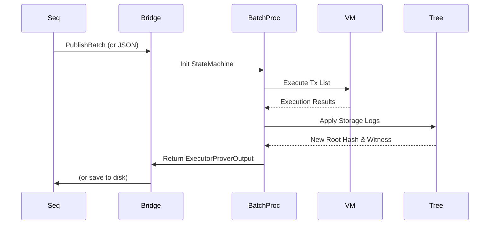
**Explanation:** Straightforward procedural flow. Execution must complete before tree updates happen, resulting in a synchronous output artifact.

---

### Prover Subsystem (Mocked)

**CRITICAL NOTE:** The Prover is currently implemented as a **Mock/Stub**. There is no real ZK proof generation occurring in the end-to-end pipeline. The diagrams below reflect the implemented mock behavior.

#### Prover Abstract Architecture
**Purpose:** Show the simulated proof generation process.
**Evidence from code:** `submitter/src/infrastructure/prover_mock.rs`, `Zk-Prover/rollup-prover/core/bin/prover/src/dummy_prover.rs`
**Mermaid Diagram:**
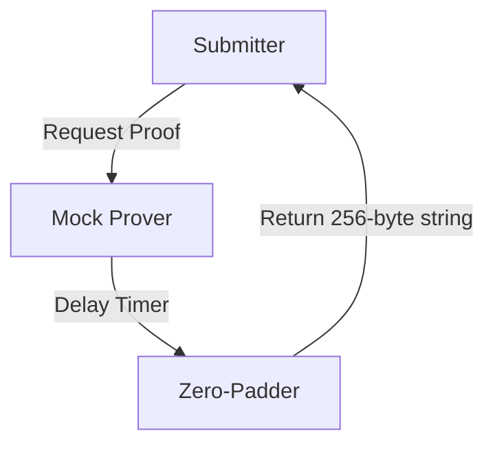
**Explanation:** When asked for a proof, the mock system simply waits and returns fixed bytes to satisfy L1 size requirements.

#### Prover Detailed Architecture
**Purpose:** Detail how the mocked prover handles requests.
**Evidence from code:** `submitter/src/infrastructure/prover_http.rs`, `submitter/src/application/proof_manager.rs` (inferred from HTTP provider error handling)
**Mermaid Diagram:**
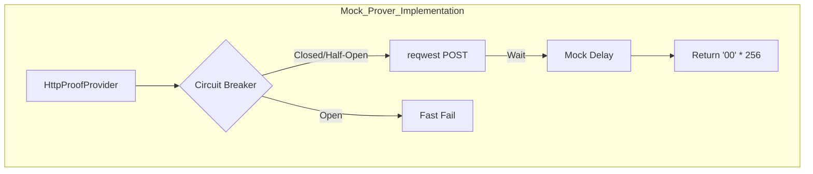
**Explanation:** The Submitter uses a robust HTTP client with a Circuit Breaker to talk to the Prover. However, the endpoint it talks to simply returns a mocked zero-string.

#### Prover Sequence Diagram
**Purpose:** Flow of a mocked proof request.
**Evidence from code:** `submitter/src/infrastructure/prover_mock.rs`
**Mermaid Diagram:**
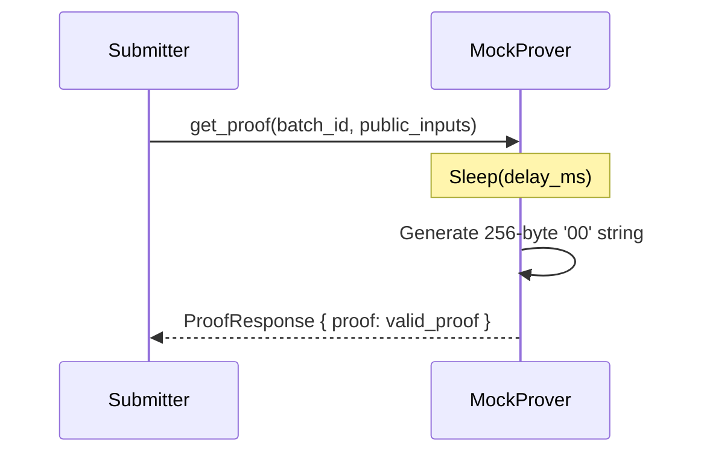
**Explanation:** The delay simulates the computational time of a real Prover without doing any real work.

---

### Submitter

#### Submitter Abstract Architecture
**Purpose:** Overview of the batch submission process.
**Evidence from code:** `submitter/README.md`, `submitter/src/submitter.rs`
**Mermaid Diagram:**
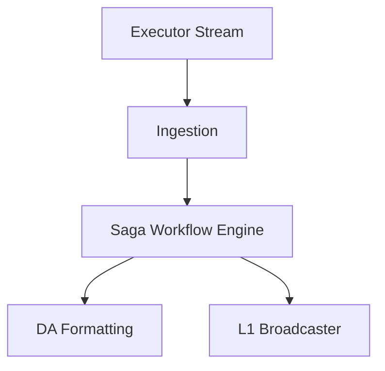
**Explanation:** The Submitter pulls execution results and uses a robust Saga pattern to ensure Data Availability and Proofs are securely and reliably posted to L1.

#### Submitter Detailed Architecture
**Purpose:** Internal DDD structure of the Submitter.
**Evidence from code:** `submitter/src/infrastructure/`
**Mermaid Diagram:**
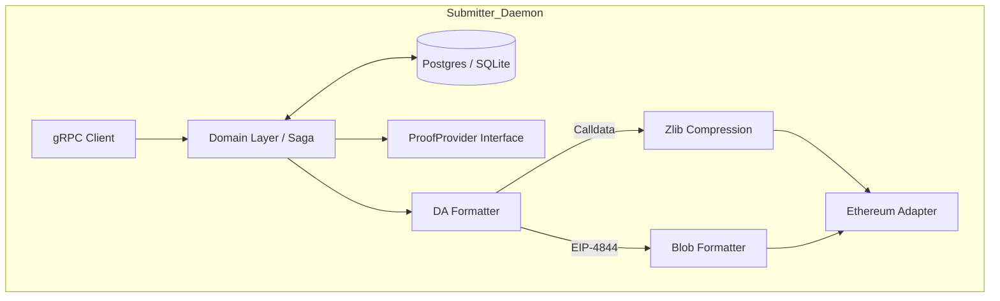
**Explanation:** Follows Hexagonal Architecture. The domain logic dictates the workflow (fetch proof -> format DA -> send tx), utilizing adapters for storage, proving, and Ethereum RPC.

#### Submitter Sequence Diagram
**Purpose:** The Saga execution loop.
**Evidence from code:** `submitter/src/infrastructure/prover_http.rs`, `submitter/README.md`
**Mermaid Diagram:**
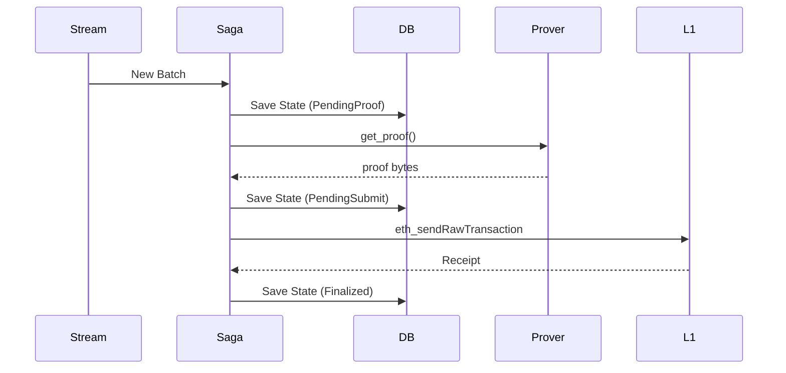
**Explanation:** Every step of the pipeline is checkpointed to the database, ensuring crash-recovery and preventing double-submission.

---

### Smart Contracts

#### Contracts Abstract Architecture
**Purpose:** High-level contract relationships.
**Evidence from code:** `contracts/AGENTS.md`
**Mermaid Diagram:**
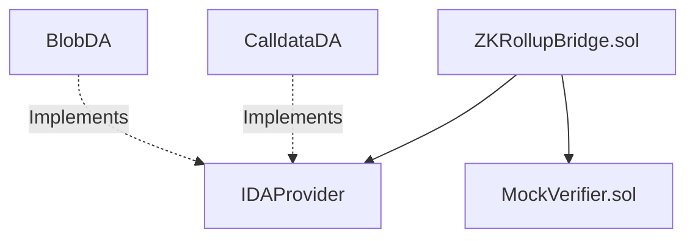
**Explanation:** The Bridge acts as the aggregate root. It delegates data availability checks to swappable DA providers and delegates proof verification to a verifier contract.

#### Contracts Detailed Architecture
**Purpose:** Contract interactions and state transitions.
**Evidence from code:** `contracts/AGENTS.md`
**Mermaid Diagram:**
```mermaid
flowchart LR
    SUB[Submitter] -->|submitBatch| BR[ZKRollupBridge]
    BR -->|Check Commitment| DA[DA Provider]
    BR -->|verifyProof| VER[Verifier Router]
    
    VER -->|True| BR
    BR -->|Update state_root| STATE[(Contract State)]
```
**Explanation:** The bridge orchestrates. It does not parse blobs; it simply takes the commitment, queries the DA provider to ensure it matches, verifies the proof, and finalizes the batch.

#### Contracts Sequence Diagram
**Purpose:** On-chain batch finalization.
**Evidence from code:** `contracts/AGENTS.md`
**Mermaid Diagram:**
```mermaid
sequenceDiagram
    participant Submitter
    participant Bridge
    participant DA_Contract
    participant Verifier

    Submitter->>Bridge: submitBatch(batchData, proof, da_commitment)
    Bridge->>DA_Contract: verifyCommitment(da_commitment)
    DA_Contract-->>Bridge: true
    Bridge->>Verifier: verify(proof, public_inputs)
    Verifier-->>Bridge: true
    Bridge->>Bridge: _finalizeBatch(update state)
```
**Explanation:** Synchronous execution within a single Ethereum transaction.

---

### Data Tools / Analytics

#### Data Tools Abstract Architecture
**Purpose:** Data pipeline overview.
**Evidence from code:** `data-tools/README.md`
**Mermaid Diagram:**
```mermaid
flowchart LR
    RAW[Raw JSON/CSV] --> AGG[aggregate.py]
    AGG --> ALL[all_results.csv]
    ALL --> STATS[stats.py]
    ALL --> PLOTS[Plotting Scripts]
```
**Explanation:** Scripts ingest metrics generated during experiments and produce aggregated CSVs, statistical summaries, and visual plots.

#### Data Tools Detailed Architecture
**Purpose:** Showing script boundaries.
**Evidence from code:** `data-tools/README.md`
**Mermaid Diagram:**
```mermaid
flowchart TD
    JSON[(workload_exp.json\nexecutor.json\nsubmitter.json)] --> AGG[aggregate.py]
    AGG --> CSV[all_results.csv]
    
    CSV --> S[stats.py]
    S --> SS[stats_summary.csv]
    
    CSV --> P1[pareto_frontier.py]
    CSV --> P2[latency_cdf.py]
    CSV --> P3[cost_heatmap.py]
    
    P1 --> PNG[figures/*.png]
    
    SS --> REPORT[generate_md.py]
    CSV --> REPORT
    REPORT --> MD[thesis_summary.md]
```
**Explanation:** The pipeline strictly decouples aggregation, statistical computation, and plotting/report generation.

#### Data Tools Sequence Diagram
**Purpose:** Analyst execution flow.
**Evidence from code:** `data-tools/README.md`
**Mermaid Diagram:**
```mermaid
sequenceDiagram
    participant User
    participant Agg
    participant Stats
    participant Plots
    participant Report

    User->>Agg: python aggregate.py
    Agg-->>User: all_results.csv
    User->>Stats: python stats.py
    Stats-->>User: stats_summary.csv
    User->>Plots: python plots/*.py
    Plots-->>User: PNG Figures
    User->>Report: python generate_md.py
    Report-->>User: thesis_summary.md
```
**Explanation:** Sequential manual (or CI-driven) execution of python scripts taking previous steps' outputs as inputs.
