# RollupX Architecture Documentation

## Part 1 — Codebase-based System Summary
The RollupX platform is an experimental, modular Layer-2 ZK-Rollup prototype. Its primary design goal is high throughput, custom transaction scheduling, and comprehensive observability across various components. 

The system implements the full transaction lifecycle from inception to execution. However, **the Zero-Knowledge proving subsystem (Prover) is currently entirely mocked/stubbed**, and data availability (DA) is posted to a local L1 (Ethereum/Hardhat) with verification checks that utilize mock verification responses. 

### Detected Components
1. **Workload Generator (Benchmark Suite)**: A Python-based tool (`benchmark-suite/`) that generates and signs varied transactions (e.g. light transfers, heavy contract calls) to simulate organic network traffic.
2. **Sequencer**: A Rust-based service (`sequencer/`) receiving REST transactions, validating them (nonce, signature, balance), ordering them according to pluggable scheduling policies (FCFS, TimeBoost, etc.), and bundling them into sealed batches.
3. **Executor**: A Rust service (`executor/`) operating over gRPC that accepts sealed batches from the Sequencer. It processes the transactions, executes the associated smart contracts, and returns the state transitions. 
4. **Prover (Mocked)**: At present, there is no real cryptographic proof generation pipeline. The system operates in "Optimistic Mode" or bypasses proof verification using a mock setup (`MockVerifier.sol` and mocked responses in the `submitter`).
5. **Submitter**: A Rust service (`submitter/`) orchestrating the state transition submission to Layer 1. It compresses the batch data and submits it to Ethereum as Calldata, Blob (EIP-4844), or Off-chain DA, handling necessary gas bumping and deduplication.
6. **Smart Contracts**: The L1 Solidity contracts (`contracts/`) which define the `ZKRollupBridge`, handling user deposits, forced exits, and verifying the state commitments submitted by the L2 sequencer.
7. **Data Tools (Metrics)**: The `data-tools/` and `benchmark-suite/metrics/` pipelines analyze system latencies, batch sizes, throughput, and fairness.
8. **UI**: A Next.js/React frontend (`ui/`) that provides system observability, showing recent batches, transaction statuses, and network throughput metrics.

---

## Part 2 — End-to-End Architecture Diagrams

### 1. E2E Abstract Architecture

#### Purpose
Provides a high-level view of the system's major components and data flow, illustrating the path from user transaction to L1 finality.

#### Evidence from code
- `sequencer/src/api/server.rs`: REST endpoints accepting transactions.
- `sequencer/src/batch/orchestrator.rs`: Batching and gRPC publishing.
- `executor/src/grpc.rs`: Receiving batches over gRPC.
- `submitter/src/daemon.rs`: Submitter pulling execution results and pushing to L1.
- `contracts/contracts/ZKRollupBridge.sol`: L1 bridge receiving state commitments.

#### Mermaid Diagram
```mermaid
flowchart LR
    WG[Workload Generator\n(Python)] -->|JSON-RPC / REST| SEQ[Sequencer\n(Rust)]
    UI[Frontend UI\n(Next.js)] -.->|Metrics/Polling| SEQ
    
    SEQ -->|Sealed Batches\n(gRPC)| EXEC[Executor\n(Rust)]
    EXEC -->|State Transitions| PROV[Prover Subsystem\n(MOCKED / Bypassed)]
    
    PROV -->|Mock Proof / State| SUB[Submitter\n(Rust)]
    SUB -->|Calldata / Blob txs| L1[(L1 Smart Contracts\nHardhat)]
    
    L1 -.->|Deposits / Forced Exits| SEQ
    
    SEQ -.->|Logs & Metrics| DT[Data Tools / Analytics]
    SUB -.->|Logs & Metrics| DT
```

#### Explanation
The `Workload Generator` posts serialized transactions to the `Sequencer`. The `Sequencer` validates and batches them, sending the batches via gRPC to the `Executor`. The `Executor` runs the transactions and passes the state diffs to the (currently mocked) `Prover`. The `Submitter` grabs the final execution output and pushes it to `L1 Smart Contracts`. 

#### Key assumptions / limitations
- The Prover is entirely mocked. In the codebase, proof submission is either bypassed (optimistic mode) or filled with dummy data (`0x...` byte arrays).

---

### 2. E2E Detailed Architecture

#### Purpose
Details the specific protocols, databases, APIs, and infrastructure boundaries across the complete RollupX stack.

#### Evidence from code
- `sequencer/config/default.toml`: Defines SQLite DB, gRPC URLs, L1 WS endpoints.
- `submitter/src/infrastructure/da_calldata.rs`: Details L1 submission strategies.
- `benchmark-suite/workload/tx_types.py`: Defines payload generation logic.

#### Mermaid Diagram
```mermaid
flowchart TD
    subgraph Client/Dev
        WG[Poisson Workload Generator\n(Python)]
    end

    subgraph Sequencer Node
        API[API Server (Axum, port 3000)]
        POOL[Transaction Pool]
        SCHED[Scheduler (Policies)]
        BATCH[Batch Orchestrator]
        SDB[(Sequencer SQLite DB)]
    end

    subgraph Executor Node
        EGRPC[Executor gRPC Server (port 50051)]
        VM[VM / Execution Engine]
    end
    
    subgraph Mocked Prover Layer
        MPROV[Mock Prover\n(Returns Dummy Proofs)]
    end

    subgraph Submitter Node
        SDA[DA Strategy\n(Calldata / Blob / Offchain)]
        SSAGA[Saga / State Manager]
        ETH[Ethereum Adapter]
    end

    subgraph L1 / Ethereum Local
        BRIDGE[ZKRollupBridge.sol]
        VERIF[MockVerifier.sol]
    end

    WG -->|HTTP POST /tx| API
    API --> POOL
    POOL --> SCHED
    SCHED --> BATCH
    BATCH <--> SDB
    BATCH -->|gRPC: PublishBatch| EGRPC
    
    EGRPC --> VM
    VM --> MPROV
    MPROV --> SSAGA
    
    SSAGA --> SDA
    SDA --> ETH
    ETH -->|JSON-RPC| BRIDGE
    BRIDGE -->|Static Call| VERIF
```

#### Explanation
This details the internal buffers. The `Sequencer` holds pending transactions in `Transaction Pool` before `Scheduler` orders them. `Batch Orchestrator` records batch metadata to an internal SQLite database (`sequencer.db`). The `Submitter` uses a Saga pattern (`SagaState`) to handle retries and gas bumps before pushing via `Ethereum Adapter` to the `ZKRollupBridge` which queries the `MockVerifier`.

#### Key assumptions / limitations
- `MockVerifier` is deployed in the default testing path instead of the `RealVerifier` due to the lack of actual zero-knowledge proof generation.

---

### 3. E2E Sequence Diagram

#### Purpose
Demonstrates the sequential runtime flow of a single batch of transactions through the entire system.

#### Evidence from code
- `benchmark-suite/poisson_generator.py`: Generates the transactions.
- `sequencer/src/api/server.rs`: Returns `SoftConfirmation`.
- `executor/src/grpc.rs`: Responds to `publish_batch`.
- `submitter/src/daemon.rs`: Submits to L1.

#### Mermaid Diagram
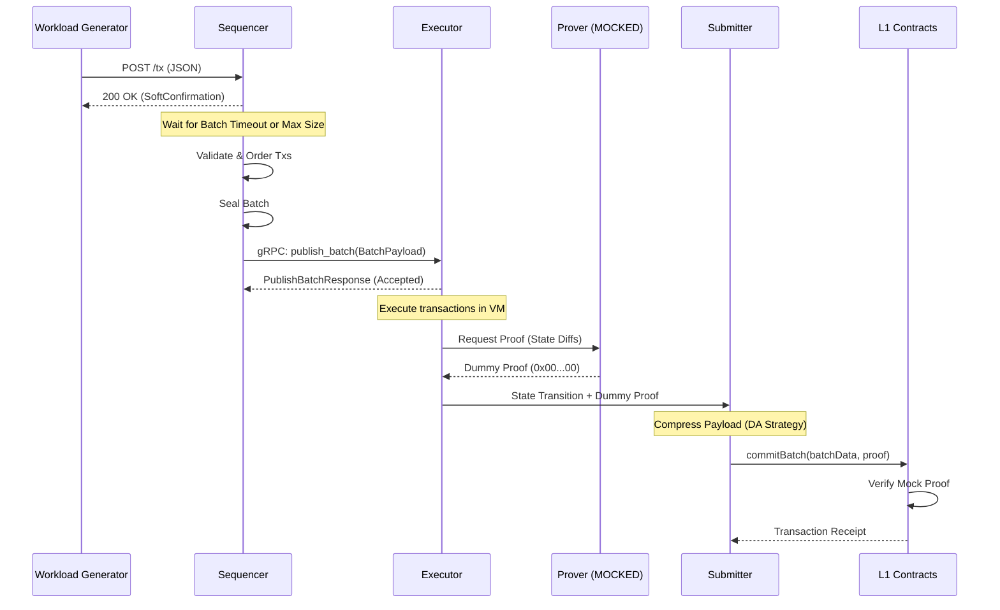

#### Explanation
The sequence represents the "happy path" of a transaction. The sequencer immediately acknowledges receipt (`SoftConfirmation`). It asynchronously groups the transaction into a batch and fires it to the executor. Execution occurs, a dummy proof is attached, and the submitter handles landing the payload on L1.

#### Key assumptions / limitations
- The step from Executor -> Prover -> Submitter is heavily simplified here. In the actual code, the `Submitter` often polls or is notified of completed batches from an internal queue or file-system store, but the exact mechanism relies on mocked bridging.

---

## Part 3 — Per-Component Architecture Diagrams

### 1. UI 

#### A. Abstract Component Architecture
**Purpose:** High-level view of the Next.js frontend dashboard.
**Evidence:** `ui/package.json`, `ui/src/components/`, `ui/src/app/`

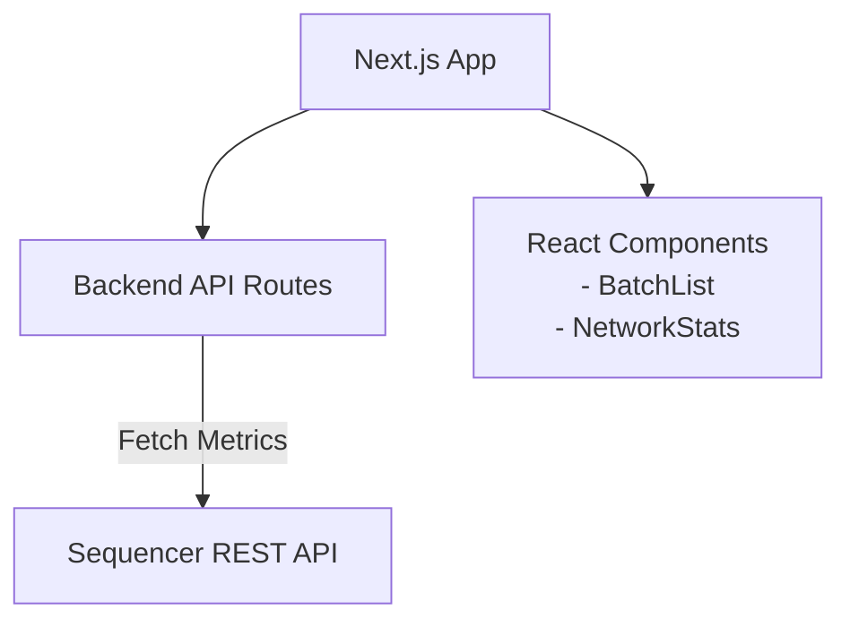

#### B. Detailed Component Architecture
**Purpose:** Details the internal UI file structure and components.
**Evidence:** `ui/src/app/page.tsx`, `ui/src/hooks/`

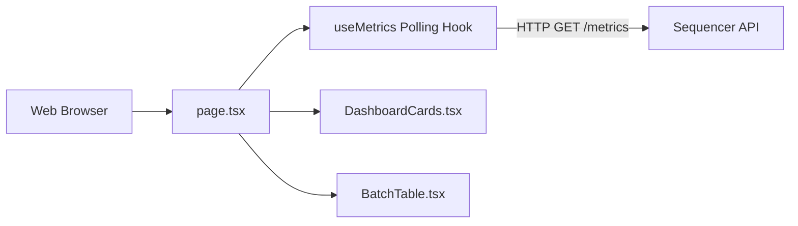

#### C. Component Sequence Diagram
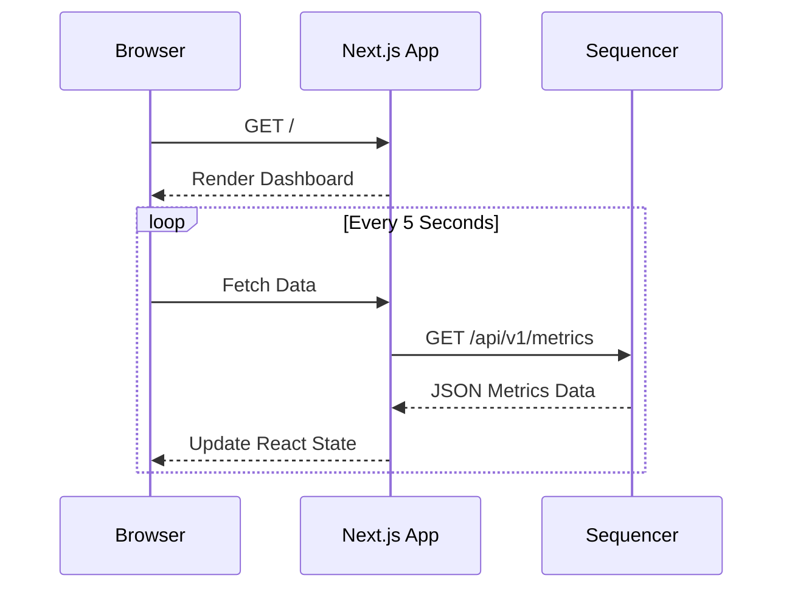
**Assumptions:** The UI purely reads from the Sequencer; it does not submit transactions itself.

---

### 2. Workload Generator / Benchmark Suite

#### A. Abstract Component Architecture
**Purpose:** High-level view of how the system simulates traffic.
**Evidence:** `benchmark-suite/poisson_generator.py`

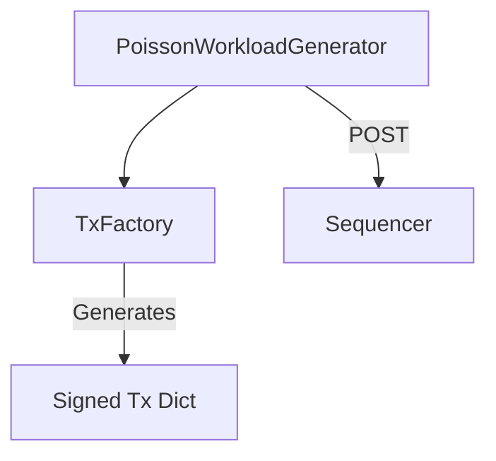

#### B. Detailed Component Architecture
**Purpose:** Detailed internal workings of the workload generator.
**Evidence:** `benchmark-suite/workload/tx_types.py`, `poisson_generator.py`

```mermaid
flowchart TD
    CLI[argparse (CLI args)] --> GEN[PoissonWorkloadGenerator]
    GEN -->|eth_getTransactionCount| SEQ_RPC[Sequencer RPC]
    GEN --> LOOP[Main Send Loop]
    LOOP --> FACTORY[TxFactory]
    FACTORY --> HASH[hash_tx / eth_utils.keccak]
    FACTORY --> SIGN[eth_keys ECDSA Sign]
    LOOP --> REQ[urllib POST request]
    REQ --> METRICS[Save to JSON/CSV]
```

#### C. Component Sequence Diagram
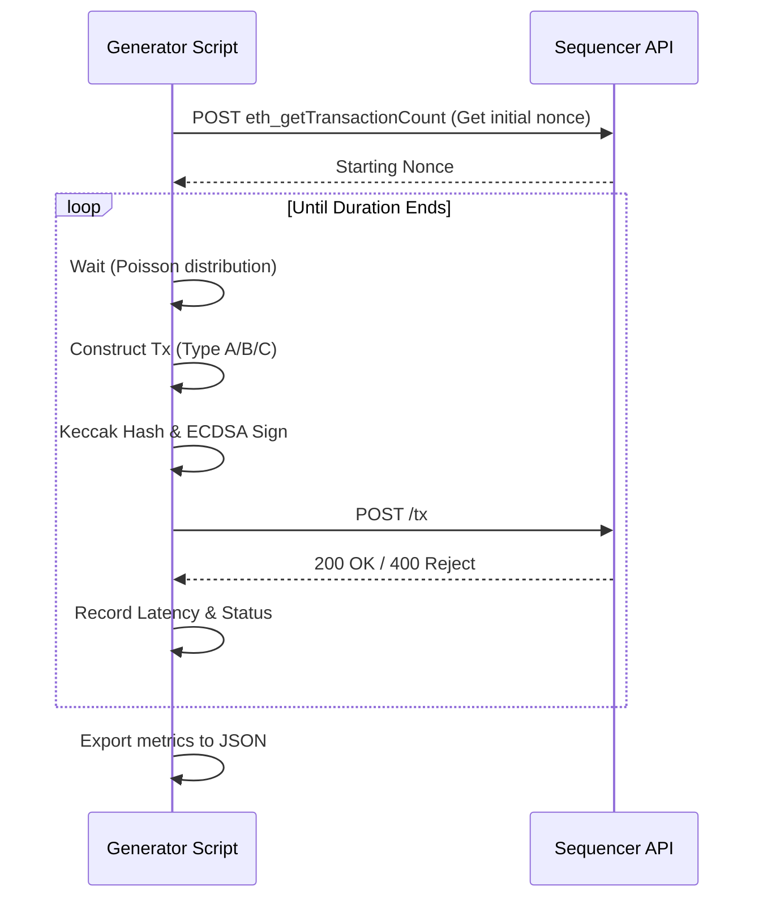
**Assumptions:** The generator dynamically fetches the starting nonce to prevent collisions across multiple rapid benchmark runs.

---

### 3. Sequencer

#### A. Abstract Component Architecture
**Purpose:** Core components of the Sequencer.
**Evidence:** `sequencer/src/main.rs`, `sequencer/src/api/server.rs`, `sequencer/src/batch/`

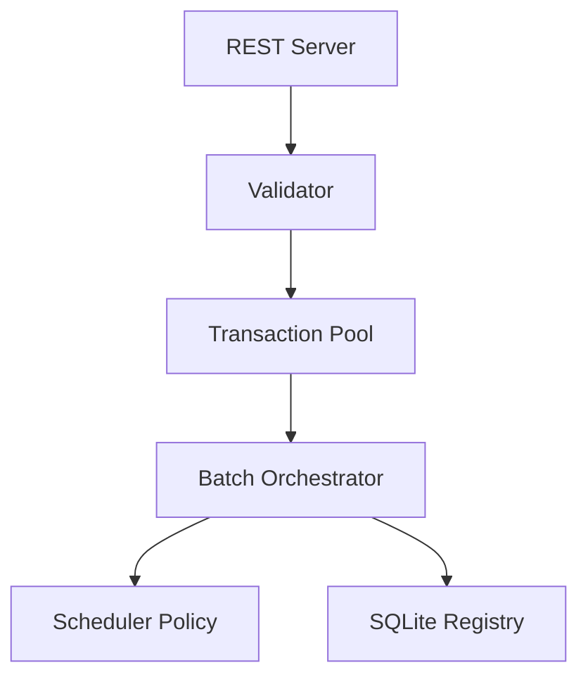

#### B. Detailed Component Architecture
**Purpose:** Internal modules and data stores within the Sequencer.
**Evidence:** `sequencer/src/state/cache.rs`, `sequencer/src/scheduler/policies.rs`

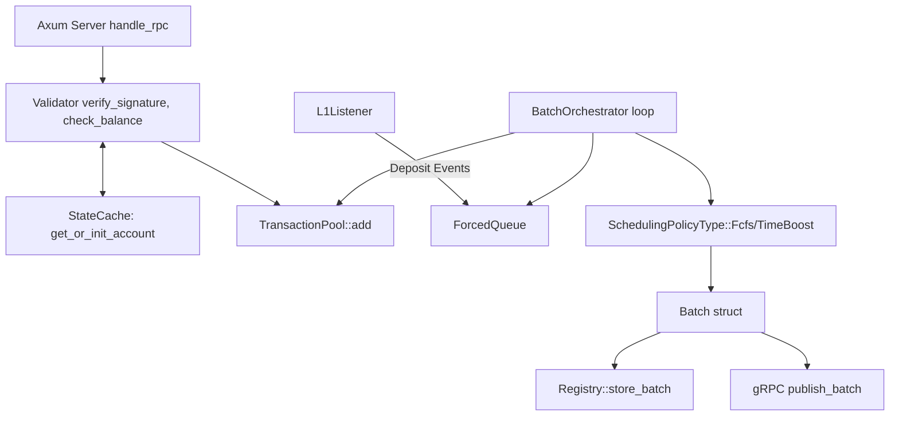

#### C. Component Sequence Diagram
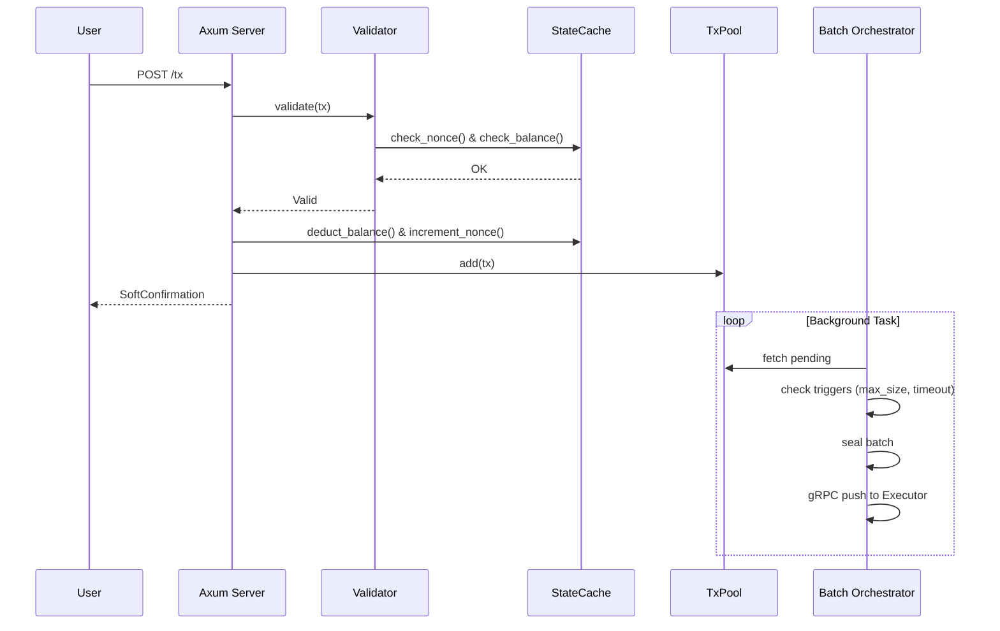
**Assumptions:** The state cache pessimistically deducts balances prior to actual execution to prevent immediate double-spending.

---

### 4. Executor

#### A. Abstract Component Architecture
**Purpose:** The execution engine interface.
**Evidence:** `executor/src/main.rs`, `executor/src/grpc.rs`

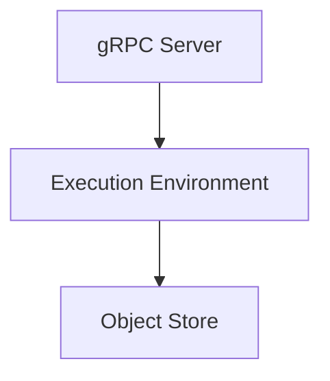

#### B. Detailed Component Architecture
**Purpose:** Details the Executor's artifact usage and dependency gates.
**Evidence:** `executor/lib/operator_signer/Cargo.toml`, `executor/src/executor.rs`

```mermaid
flowchart TD
    GRPC[RollupServiceServer] --> RECV[publish_batch handler]
    RECV --> CHANNEL[broadcast::channel]
    CHANNEL --> WORKER[Execution Worker]
    
    WORKER --> BOOT[Bootloader.zbin]
    WORKER --> ZKVM[zkEVM Instance]
    
    ZKVM --> STATE[ObjectStore (local/gcs/s3)]
    ZKVM --> SIGNER[OperatorSigner (Local/GCP-KMS)]
```

#### C. Component Sequence Diagram
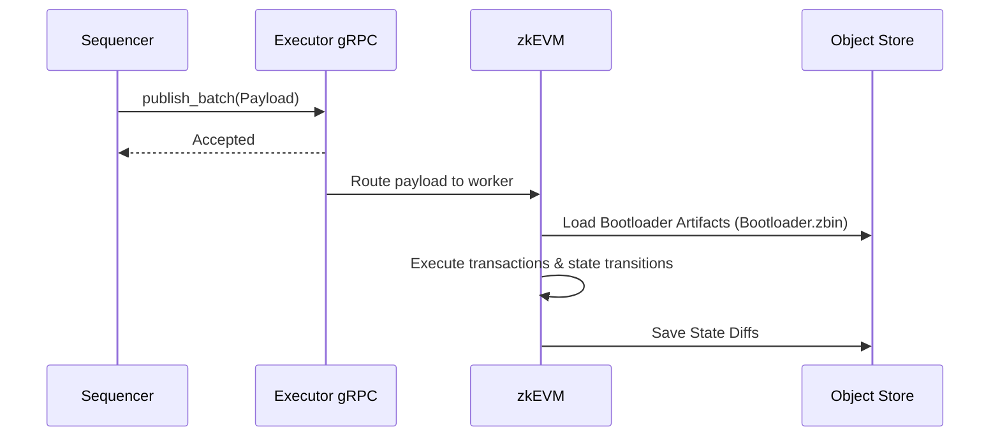
**Assumptions:** The true ZK proving process fails in unit testing locally because the pre-compiled system-contract artifacts (`Bootloader.zbin`) are not distributed in the repository by default.

---

### 5. Prover / Proof Subsystem (MOCKED)

#### A. Abstract Component Architecture
**Purpose:** Clarifies that the proving mechanism is non-functional/stubbed.
**Evidence:** Submitter testing (`submitter/src/infrastructure/da_calldata.rs`) passing `0x00..00` arrays for proofs.

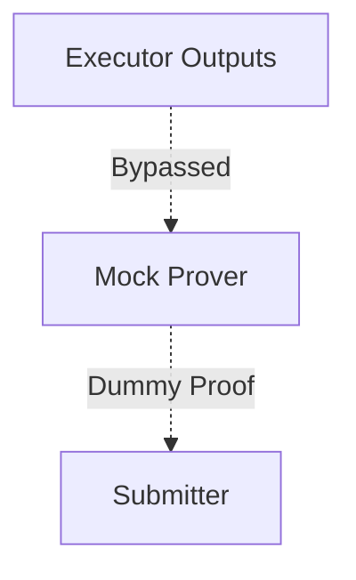

#### B. Detailed Component Architecture
**Purpose:** Shows where the mock intercepts the real system.
**Evidence:** Hardcoded proof arrays in `submitter/src/infrastructure/da_calldata.rs:238`.

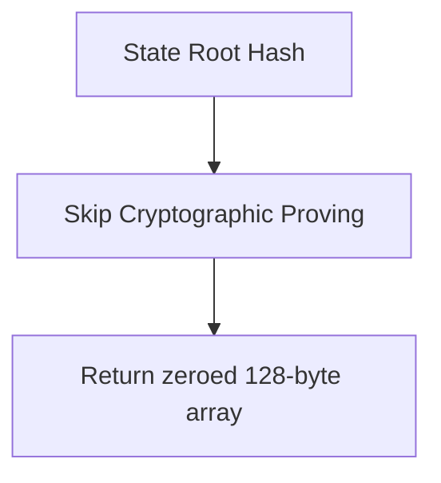

#### C. Component Sequence Diagram
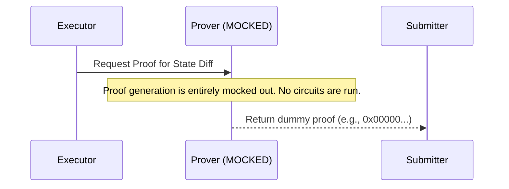
**Assumptions:** In production, this would be a cluster of GPU/CPU workers generating SNARKs/STARKs. Here, it is completely skipped to unblock L1 data availability testing.

---

### 6. Submitter

#### A. Abstract Component Architecture
**Purpose:** Handles publishing batches to Ethereum.
**Evidence:** `submitter/src/daemon.rs`, `submitter/src/infrastructure/da_blob.rs`

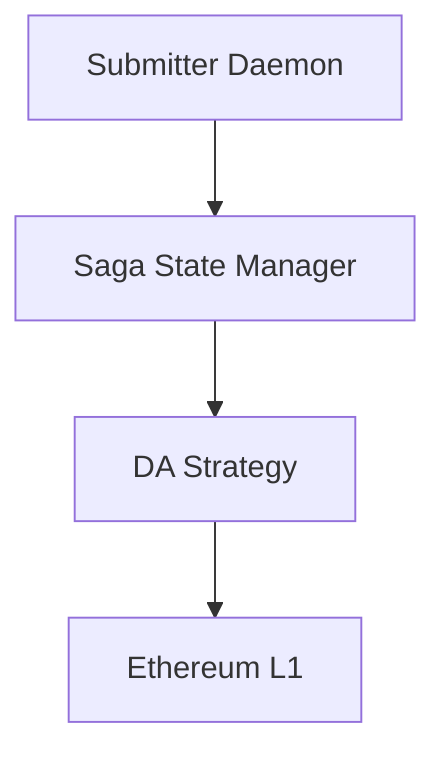

#### B. Detailed Component Architecture
**Purpose:** Details how the submitter handles varying DA mechanisms.
**Evidence:** `submitter/src/saga.rs`, `submitter/src/infrastructure/da_calldata.rs`

```mermaid
flowchart TD
    DAEMON[Daemon Loop] --> FETCH[Fetch Unsubmitted Batches]
    FETCH --> SAGA[Saga DB (SQLite)]
    SAGA --> COMPRESS[CompressionStrategy]
    
    COMPRESS --> MATCH{DA Mode}
    MATCH -->|Calldata| CALL[CalldataStrategy]
    MATCH -->|Blob| BLOB[BlobStrategy (EIP-4844)]
    MATCH -->|Offchain| OFF[OffchainStrategy]
    
    CALL --> ETH[ethers-rs SignerMiddleware]
    BLOB --> ETH
    
    ETH --> BRIDGE[ZKRollupBridge]
```

#### C. Component Sequence Diagram
```mermaid
sequenceDiagram
    participant Daemon
    participant Saga
    participant DA as DA Strategy
    participant L1 as Ethereum (Hardhat)

    Daemon->>Saga: Get pending batches
    Saga-->>Daemon: Batch 26
    Daemon->>DA: compress & format
    DA->>L1: estimateGas()
    DA->>L1: sendTransaction(commitBatch)
    
    alt Stuck Transaction
        L1-->>DA: Timeout
        DA->>DA: Bump Gas Price (+10%)
        DA->>L1: resendTransaction()
    end
    
    L1-->>DA: Receipt
    DA->>Saga: mark_submitted()
```
**Assumptions:** The Saga state machine persists submission attempts to recover gracefully from mid-flight crashes.

---

### 7. Smart Contracts

#### A. Abstract Component Architecture
**Purpose:** The L1 contracts managing L2 state.
**Evidence:** `contracts/contracts/ZKRollupBridge.sol`, `contracts/contracts/verifiers/MockVerifier.sol`

```mermaid
flowchart TD
    BRIDGE[ZKRollupBridge] --> VERIFIER[MockVerifier]
    BRIDGE --> DA[BlobDA / Data Availability]
```

#### B. Detailed Component Architecture
**Purpose:** Details the internal functions of the bridge.
**Evidence:** `ZKRollupBridge.sol`

```mermaid
flowchart TD
    USER[User] -->|deposit()| BRIDGE[ZKRollupBridge]
    USER -->|forceTransaction()| BRIDGE
    
    SUB[Submitter] -->|commitBatch()| BRIDGE
    
    BRIDGE --> VAL{Validation}
    VAL -->|Verify Sequencer| NEXT
    VAL -->|Verify Previous Root| NEXT2
    
    NEXT2 --> MOCK[MockVerifier.verifyProof()]
    MOCK -->|Returns True| UPDATE[Update State Root]
```

#### C. Component Sequence Diagram
```mermaid
sequenceDiagram
    participant Submitter
    participant Bridge as ZKRollupBridge
    participant Verifier as MockVerifier

    Submitter->>Bridge: commitBatch(batchData, newRoot, dummyProof)
    Bridge->>Bridge: Ensure msg.sender == sequencer
    Bridge->>Verifier: verifyProof(dummyProof)
    Note over Verifier: Always returns True in local dev
    Verifier-->>Bridge: True
    Bridge->>Bridge: stateRoot = newRoot
    Bridge-->>Submitter: Emit BatchCommitted Event
```
**Assumptions:** `RealVerifier` exists in the codebase, but the deployment script and tests heavily utilize `MockVerifier` to bypass the rigorous cryptographic checks for local testing.

---

### 8. Data Tools / Metrics / Analytics

#### A. Abstract Component Architecture
**Purpose:** Analyzes the output of the benchmark suite.
**Evidence:** `benchmark-suite/metrics/`, `data-tools/`

```mermaid
flowchart TD
    METRICS[JSON/CSV Logs] --> AGG[aggregate.py]
    AGG --> STATS[stats.py]
    STATS --> PLOT[Plots & Reports]
```

#### B. Detailed Component Architecture
**Purpose:** The pipeline for generating benchmark reports.
**Evidence:** `benchmark-suite/PLAN.md`

```mermaid
flowchart LR
    RUN1[workload_exp_1.json] --> AGG[Aggregation Engine]
    RUN2[workload_exp_2.json] --> AGG
    
    AGG -->|Merged Dataset| ANALYSIS[Statistical Analysis]
    ANALYSIS -->|TPS, Latency| PARETO[Pareto Frontiers]
    ANALYSIS -->|Tx Types| FAIR[Fairness Plots]
```

#### C. Component Sequence Diagram
```mermaid
sequenceDiagram
    participant Gen as Workload Generator
    participant FS as File System
    participant Agg as aggregate.py
    participant Stats as stats.py
    
    Gen->>FS: write(tx_log_exp_XXX.csv)
    Gen->>FS: write(workload_exp_XXX.json)
    
    Note over Agg: Post-experiment run
    Agg->>FS: Read all exp_*.json
    Agg->>Agg: Merge and Normalize Data
    Agg->>Stats: Generate Dataframes
    Stats->>FS: Save PDF Plots & Markdown Reports
```
**Assumptions:** Metrics generation is disconnected from the runtime of the blockchain components, acting purely as a post-mortem analytical tool.

---

## Part 4 — Gaps, Mocked Areas, and Incomplete Flows
* **Zero Knowledge Proving**: As stated throughout, `RealVerifier.test.ts` exists to test the bounds of the pairing curves, but the actual ZKVM proof generation is bypassed locally. The executor drops dummy arrays which the `MockVerifier` blindly accepts.
* **Bootloader Artifacts**: The Executor's `cargo test` suite fails specifically because `Bootloader.zbin` and other system contract artifacts are not checked into source control or properly downloaded during standard build commands. 
* **L1 Event Listener (Sequencer)**: The Sequencer attempts to connect to the Hardhat node on startup to listen for forced transactions (Exodus mode). If the node is not available, it throws `Connection refused` logs, though it attempts to reconnect continuously in the background.
* **Executor GCP-KMS Dependencies**: To allow the executor to compile with the strictly pinned `nightly-2024-08-01` compiler, modern dependencies (`alloy`, `gcloud-sdk`) were hidden behind a `#[cfg(feature = "gcp-kms")]` flag and disabled by default.

