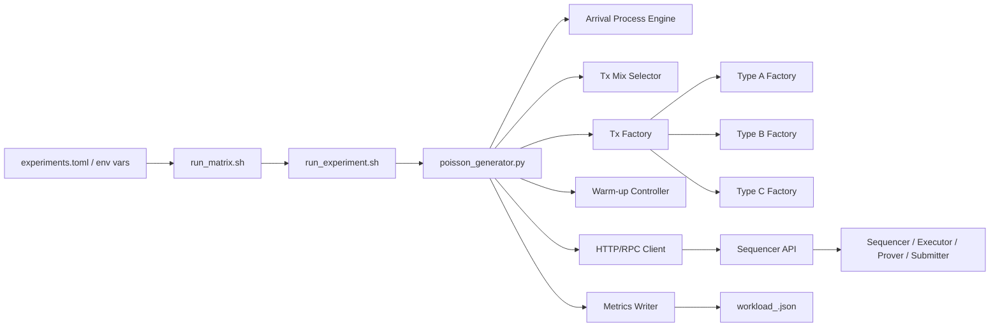
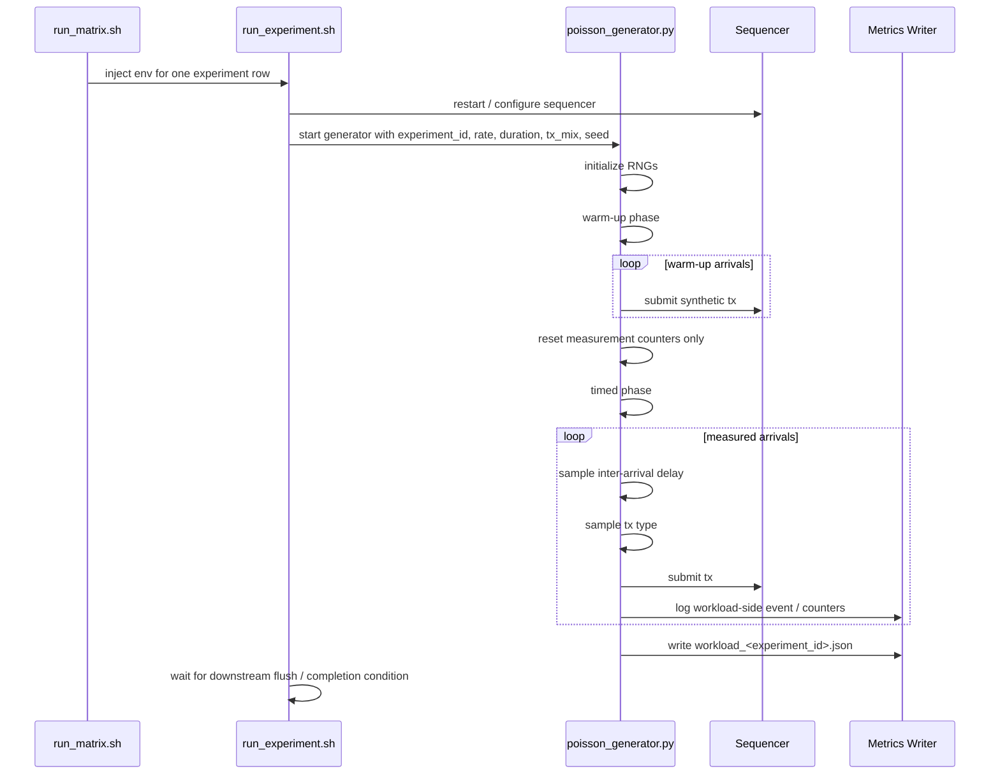
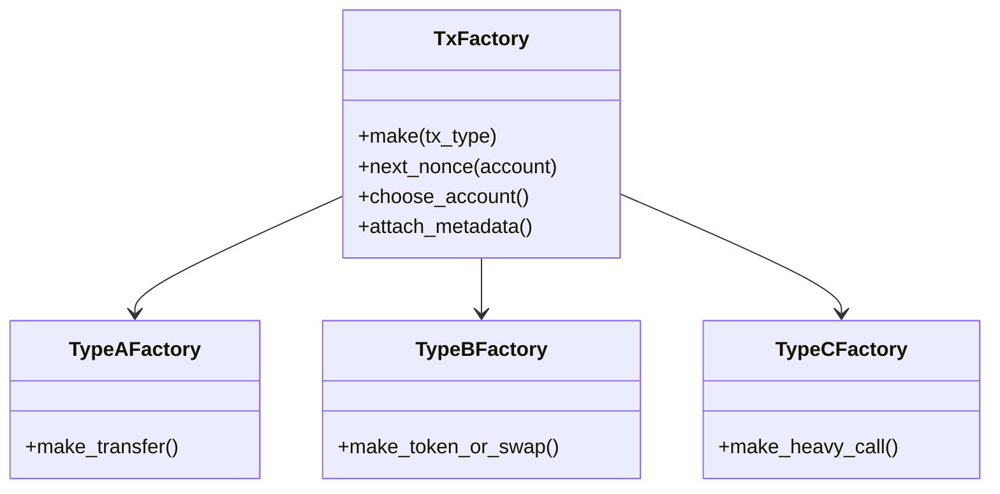
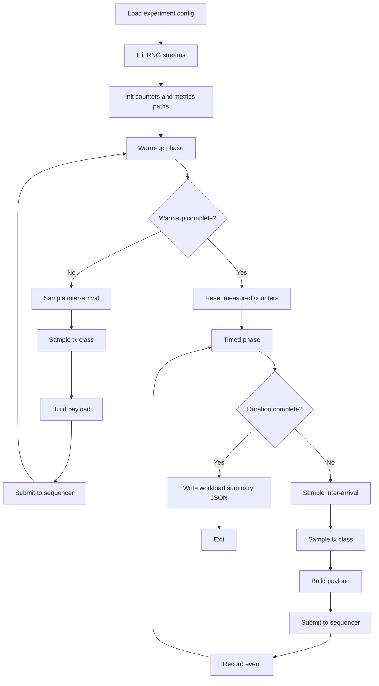
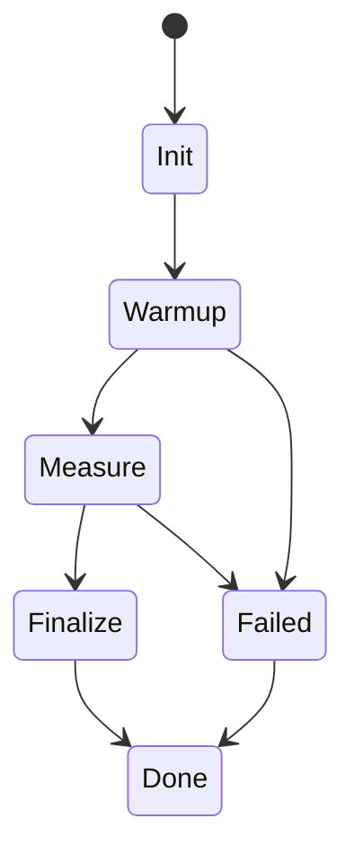

# RollupX Workload Generation Methodology and Architecture

## 1. Purpose

This document defines the methodology, architecture, data flow, algorithms, and execution model for the RollupX workload-generation subsystem.

The workload generator exists to produce controlled, reproducible, and analyzable transaction streams for the RollupX benchmarking pipeline. Its design is grounded in the project’s experimental goals:

- vary batch size, timeout, scheduling policy, data-availability mode, and proof backend
- evaluate throughput, latency, gas cost, proof-generation time, verification time, and data-availability effects
- study heterogeneous workloads rather than uniform synthetic traffic
- support repeated experiments with stable seeds and structured output
- preserve compatibility with the existing benchmark-suite and data-tools contract

## 2. Design basis

This design is aligned with the project proposal and progress report:

- the proposal defines the independent variables as batch size, batch frequency / timeout, sequencer policy, DA mode, and proof system, and the dependent variables as throughput, latency, gas cost, proof-generation time, verification time, and DA effect
- the proposal also requires systematic setup, repeated runs, structured data collection, and analysis
- the progress report refines the workload model into heterogeneous transaction classes A/B/C and experiment regimes such as balanced steady-state, heavy-skew sensitivity, and bursty arrival patterns under latency constraints
- the current benchmark plan anchors the implementation around `benchmark-suite/`, `workload/poisson_generator.py`, `tx_types.py`, `scripts/run_experiment.sh`, `scripts/run_matrix.sh`, and a stable metrics JSON contract

## 3. Scope

This document covers only the workload-generation layer.

Included:
- workload modeling
- traffic patterns
- transaction-class definitions
- repeatability strategy
- runtime orchestration interface
- metadata and output files
- generator algorithms
- Mermaid diagrams for architecture and flow

Excluded:
- sequencer internals
- executor/prover internals
- submitter logic
- on-chain contract logic
- final analytics and plotting implementation

## 4. Core goals

The workload generator must satisfy five goals:

1. **Represent heterogeneity**
   - transactions must not all look alike
   - at least light, medium, and heavy classes must be represented

2. **Control experimental variables**
   - rate, duration, warm-up, seeds, tx mix, and experiment id must be configurable

3. **Stay reproducible**
   - identical seeds and configs should produce identical workload traces

4. **Feed the whole benchmark stack**
   - the sequencer must receive transactions in the intended order and timing
   - metrics files must remain compatible with downstream tools

5. **Enable fair comparison**
   - experiments must differ only in intended factors
   - the generator should not inject hidden randomness across runs

## 5. High-level architecture



## 6. Architectural components

### 6.1 Configuration intake

The workload generator receives configuration from two layers:

- **experiment matrix**
  - `batch_size`
  - `timeout_ms`
  - `policy`
  - `da_mode`
  - `prover`
  - `rate_tps`
  - `duration_s`
  - `warmup_s`
  - `tx_mix`
  - `repeats`
  - `seeds`

- **runtime environment**
  - `METRICS_ROOT`
  - `SEQ_HOST`
  - `SEQ_PORT`
  - optional DA / prover / policy overrides passed through the shell scripts

The generator itself primarily needs:

- `experiment_id`
- `rate`
- `duration`
- `warmup`
- `seed`
- `tx_mix`
- host / port / endpoint configuration

### 6.2 Arrival process engine

This module decides **when** the next transaction should be emitted.

Baseline design:
- Poisson arrival process
- inter-arrival time sampled from an exponential distribution with parameter `rate_tps`

Why this choice:
- simple
- analytically common
- supports stable load generation
- matches the current benchmark plan and existing `poisson_generator.py`

### 6.3 Tx mix selector

This module decides **what kind** of transaction arrives next.

It supports:
- named presets such as `balanced`, `light`, `heavy`
- custom fractional mixtures
- deterministic selection under a fixed seed

### 6.4 Transaction factory

This module constructs a valid transaction payload for the selected type.

It should encapsulate:
- nonce management
- sender/account selection
- payload generation
- gas / proving / DA-footprint parameters
- optional tags or metadata for later attribution

### 6.5 Warm-up controller

This module runs a pre-measurement phase to bring the system into steady state before timed measurement begins.

Responsibilities:
- send warm-up transactions
- keep nonce progression realistic
- ensure the timed phase starts from a live, non-empty system state
- exclude warm-up requests from measured workload totals

### 6.6 Metrics writer

This module writes structured workload-side metadata, not full system performance.

Typical output:
- experiment id
- repeat id
- seed
- mix
- offered rate
- duration
- warm-up duration
- total emitted tx count
- tx count by class
- expected load profile
- timestamps for run start / end

## 7. Transaction model

The progress report defines three realistic abstract classes.

### 7.1 Type A — Light

Examples:
- simple transfer
- deposit
- balance update

Characteristics:
- low proving cost
- low data-availability footprint
- low execution cost

Use:
- represents common inexpensive transactions
- provides background load

### 7.2 Type B — Medium

Examples:
- ERC-20 transfer
- token movement
- swap-like operation

Characteristics:
- moderate proving cost
- moderate DA footprint
- moderate execution complexity

Use:
- bridges the gap between trivial and expensive operations

### 7.3 Type C — Heavy

Examples:
- complex contract call
- multi-step state update
- computationally heavy synthetic operation

Characteristics:
- high proving cost
- relatively high computational burden
- may have smaller or different DA footprint than B depending on the design

Use:
- stressor class for heterogeneity sensitivity and policy evaluation

## 8. Recommended mix presets

These presets are compatible with the current plan and the progress report’s workload regimes.

| Mix name | A | B | C | Purpose |
|---|---:|---:|---:|---|
| balanced | 0.70 | 0.20 | 0.10 | steady-state baseline |
| light | 0.95 | 0.04 | 0.01 | mostly cheap traffic |
| medium | 0.50 | 0.35 | 0.15 | mixed practical workload |
| heavy | 0.20 | 0.30 | 0.50 | heterogeneity stress |
| burst_heavy | dynamic | dynamic | dynamic | burst regime under SLA |

## 9. Workload regimes

The progress report defines three core regimes. They should become first-class generator modes.

### 9.1 Balanced steady-state

- constant target rate
- Poisson arrivals
- fixed mix such as `balanced`
- used for baseline benchmarking

### 9.2 Heterogeneity sensitivity

- constant arrival rate
- gradually increase Type C ratio
- used to test when naive batching degrades

### 9.3 Bursty latency-constrained

- alternating calm and burst periods
- hard or soft waiting-time SLA
- used to test timeout-driven, soft-cap, and transaction-aware policies

## 10. Generator execution lifecycle



## 11. Data contracts

The generator must preserve the benchmark suite contract.

Expected workload-side artifact:

```text
metrics/<exp_id>/workload_<exp_id>.json
```

Recommended structure:

```json
{
  "experiment_id": "bs_050_r01",
  "repeat_id": "r01",
  "seed": 42,
  "rate": 10,
  "warmup_s": 30,
  "duration_s": 120,
  "tx_mix": "balanced",
  "details": {
    "total_txs": 1187,
    "class_counts": {
      "A": 832,
      "B": 238,
      "C": 117
    },
    "host": "localhost",
    "port": 3000,
    "arrival_model": "poisson",
    "regime": "steady_state"
  }
}
```

If more fields are added, the existing keys used by downstream tools must not be broken.

## 12. RNG strategy

To keep the generator reproducible and stable, split randomness into independent streams.

Recommended streams:
- `rng_arrival = Random(seed)`
- `rng_mix = Random(seed + 1000)`
- `rng_factory = Random(seed + 2000)`
- `rng_accounts = Random(seed + 3000)`

Why:
- changing tx payload internals should not silently change arrival timing
- changing account selection should not silently change type-selection sequence
- repeated experiments become easier to compare and debug

## 13. Warm-up methodology

Warm-up is not optional for this benchmark.

### Why warm-up matters

Without warm-up:
- first-batch latency is artificially low or high
- prover and submitter queues are empty
- nonce/state initialization overhead pollutes measurements
- early measurements exaggerate cold-start behavior

### Warm-up rules

- warm-up transactions are fully submitted to the system
- warm-up advances nonces and internal queues
- warm-up statistics are logged separately
- warm-up events are excluded from timed summaries
- the RNG state may continue across warm-up and measurement for realistic continuity, but the measured counters must reset after warm-up

## 14. Detailed algorithm

### 14.1 Baseline Poisson generation algorithm

```text
Input:
    λ = target rate in tx/s
    warmup_s
    duration_s
    seed
    tx_mix
    tx_factory

Initialize:
    rng_arrival, rng_mix, rng_factory, rng_accounts
    t0 = now()
    t_end_warmup = t0 + warmup_s
    t_end_measure = t_end_warmup + duration_s
    counters_warmup = zero
    counters_measure = zero

Phase 1: warm-up
    while now() < t_end_warmup:
        dt = Exp(λ)
        sleep(dt)
        cls = sample(tx_mix, rng_mix)
        tx = tx_factory.make(cls)
        submit(tx)
        counters_warmup[cls] += 1

Phase 2: measured run
    while now() < t_end_measure:
        dt = Exp(λ)
        sleep(dt)
        cls = sample(tx_mix, rng_mix)
        tx = tx_factory.make(cls)
        ts_submit = now()
        submit(tx)
        log_submit_event(experiment_id, cls, ts_submit)
        counters_measure[cls] += 1

Finalize:
    write workload_<experiment_id>.json
```

### 14.2 Heterogeneity sensitivity algorithm

```text
For each sensitivity step s in S:
    define mix_s = (A_s, B_s, C_s)
    run the same baseline generator with:
        same rate
        same duration
        same warm-up
        same seed schedule policy
        only mix_s changed
```

### 14.3 Bursty arrival algorithm

```text
Define piecewise rate function λ(t):
    λ_base during normal periods
    λ_burst during burst windows

For each event:
    compute current λ from schedule
    sample dt ~ Exp(λ(t))
    emit tx as usual
```

This can be implemented as:
- a burst calendar
- a sinusoidal approximation
- an ON/OFF process
- or a fixed episode schedule

## 15. Transaction factory design



### Recommended factory responsibilities

#### Shared responsibilities
- account selection
- nonce continuity
- experiment tagging
- tx-class tagging
- destination selection
- common serialization

#### Per-class responsibilities
- payload complexity
- gas limit or resource tag
- calldata size
- proving-cost proxy
- DA footprint proxy

## 16. Suggested payload schema

Even if the benchmark uses simplified mock transactions, each payload should carry metadata that helps later analysis.

Example:

```json
{
  "tx_id": "bs_050_r01_000123",
  "tx_type": "B",
  "sender": "0xabc...",
  "nonce": 54,
  "logical_op": "token_transfer",
  "payload_bytes": 164,
  "expected_proving_weight": 2.0,
  "expected_da_weight": 2.0,
  "submit_ts_ms": 1743750100000
}
```

These fields do not all need to be forwarded on-chain, but they are useful for workload logs and debugging.

## 17. Quality requirements

### Functional
- generate traffic at requested rate
- preserve tx mix ratios approximately over long runs
- write workload JSON correctly
- support warm-up and measured phases
- accept experiment-level parameters

### Non-functional
- deterministic under fixed seeds
- low overhead compared to target rate
- resilient to transient sequencer failures
- compatible with run_matrix orchestration
- easy to extend with new transaction classes

## 18. Error handling strategy

The generator must handle:
- HTTP submission failure
- connection refused
- timeout
- malformed endpoint responses
- partial run interruption

Recommended behavior:
- fail fast for infrastructure errors during controlled experiments
- write partial status if the run aborts
- record counts sent before failure
- never silently succeed if zero transactions were accepted

## 19. Logging strategy

The generator should produce:
- console summary for humans
- structured JSON for downstream tools
- optional per-tx CSV / JSONL for deep analysis

Recommended outputs:
- `workload_<exp_id>.json`
- `tx_log_<exp_id>.csv` or `.jsonl`
- `run_status.json`

## 20. Suggested CLI

```bash
python workload/poisson_generator.py \
  --experiment_id bs_050_r01 \
  --rate 10 \
  --duration 120 \
  --warmup 30 \
  --seed 42 \
  --tx_mix balanced \
  --host localhost \
  --port 3000 \
  --prover_backend groth16
```

Optional extensions:
- `--regime steady_state|hetero|burst`
- `--mix_a 0.70 --mix_b 0.20 --mix_c 0.10`
- `--burst_rate 40`
- `--burst_window_s 10`
- `--idle_window_s 30`

## 21. Full workload-generation flow



## 22. State machine



## 23. Methodological recommendations

1. Use **at least 5 repeats** per configuration.
2. Fix seeds explicitly, for example `42..46`.
3. Keep warm-up duration constant across comparable runs.
4. Separate randomness streams.
5. Use the same account pool across runs unless that factor is being studied.
6. Record actual emitted counts, not only target rate.
7. Add burst mode because the progress report explicitly includes bursty arrivals and latency-constrained evaluation.
8. Preserve compatibility with downstream metrics readers.
9. Treat tx classes as meaningful cost / DA / proving categories, not just labels.
10. Keep workload generation simple enough to reason about but rich enough to expose heterogeneity.

## 24. Risks and limitations

- Poisson traffic alone may underrepresent real user burstiness.
- Abstract Type A/B/C classes are a model, not a complete reproduction of production rollups.
- If transaction factories share one RNG stream, tiny payload changes can break reproducibility.
- If warm-up is skipped, early-batch measurements become unreliable.
- If tx classes only differ by destination address, heterogeneity claims become weak.

## 25. Recommended repository name

The current name `benchmark-suite` is acceptable, but if you want a more accurate repo name specifically for this subsystem, the best options are:

1. **rollupx-workload-orchestrator**
   - best if the repo contains the generator plus experiment-running scripts

2. **rollupx-traffic-lab**
   - shorter and easier to remember, good if you want a more project-style name

3. **rollupx-experiment-harness**
   - best if you want the repo name to emphasize controlled experimental execution rather than only traffic generation

### My recommendation
Use:

- **rollupx-experiment-harness** for the workload-side repo
- because it covers generator + scripts + experiment matrix, not just tx emission
