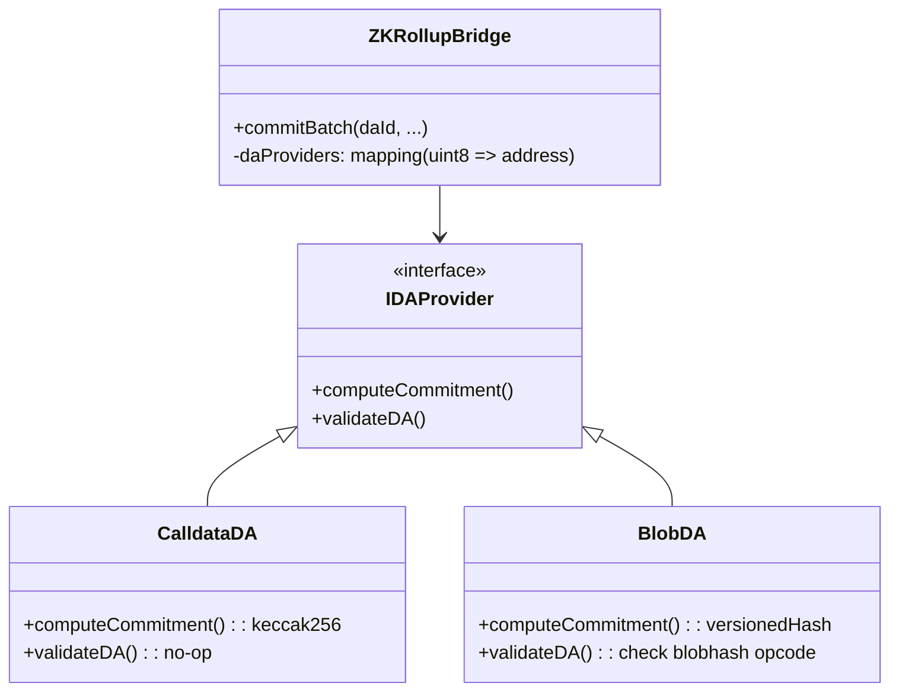

# System Architecture

This document details the architectural design of the **ZK Rollup Bridge contracts**, focusing on the modular Strategy Pattern, Security Model, and Data Flow.

## 1. Modular DA Strategy Pattern

To support research into Data Availability costs (RQ3), the Bridge delegates DA verification to external provider contracts. This allows hot-swapping between `Calldata` and `Blob` modes without modifying the core bridge logic.

### Flow
1.  **Sequencer** (via Submitter) chooses a DA mode (e.g., `daId=1` for Blobs).
2.  **Bridge** looks up the `provider` address.
3.  **Bridge** calls `provider.computeCommitment(...)` to get the `daCommitment` used in the ZK Proof public inputs.
4.  **Bridge** calls `provider.validateDA(...)` to ensure the data is actually available on L1 (e.g., verifying the `blobhash`).

## 2. State Verification & Math

The system uses **Groth16** proofs on the **BN254** curve.

### Public Inputs
The ZK Circuit must accept exactly three public inputs in this specific order:
1.  `daCommitment`: The hash of the data (ensures the data matches the state transition).
2.  `oldRoot`: The previous state root (ensures chain continuity).
3.  `newRoot`: The proposed state root.

These inputs are usually split into high/low limbs (128-bit) in the circuit to accommodate field size limits, but the Solidity verifier typically reconstructs them or expects them as full 256-bit values if the `Verifier.sol` is generated by standard tools like SnarkJS. *Note: The specific implementation details depend on the `RealVerifier.sol` generated by the Executor's key generation tool.*

### Scalar Field Reduction
All `bytes32` inputs (hashes) are modulo-reduced to the BN254 Scalar Field size to be compatible with the SNARK circuit.

$$
Input_{field} = Input_{bytes32} \pmod{R}
$$

Where $R$ is the order of the scalar field:
`21888242871839275222246405745257275088548364400416034343698204186575808495617`

This reduction happens inside `ZKRollupBridge._toFieldElement` before calling the Verifier.

## 3. Censorship Resistance

The "Adversarial Review" identified centralized sequencing as a risk. The architecture includes an on-chain **Forced Inclusion** mechanism.

### Mechanism: Time-Locked Queue
1.  **User Request:** A user calls `forceTransaction(txHash)`.
2.  **Timestamp:** The contract records `deadline = block.number + forcedInclusionDelay`.
3.  **Sequencer Obligation:** The sequencer *should* include this transaction before the deadline.
4.  **Enforcement (Active):** If the deadline passes without inclusion, the Bridge reverts any `commitBatch` attempt with `BridgeFrozenError`. This effectively freezes the sequencer until the censorship is resolved (currently requires admin intervention or upgrade to full Exodus mode).

## 4. Contract Relationships

*   **Ownable2Step**: The Bridge inherits from OpenZeppelin's `Ownable2Step` for secure admin key rotation.
*   **Verifier**: An immutable reference to a `RealVerifier` (generated by SnarkJS) or `MockVerifier` (for testing).
*   **Libraries**:
    *   `Constants.sol`: Stores cryptographic constants (Scalar Field, Prime Q).
    *   `Pairing.sol`: Helper for BN254 pairing checks (used by RealVerifier).
