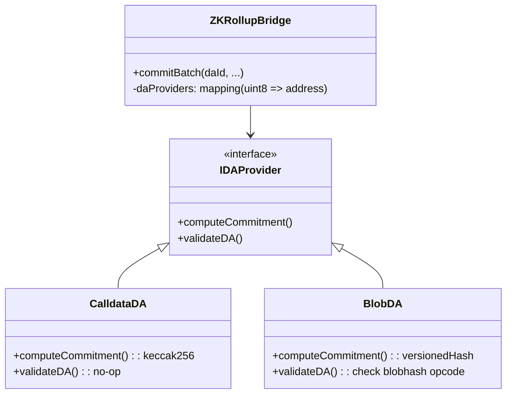

# System Architecture

This document details the architectural design of the **ZK Rollup Bridge contracts**, focusing on the modular Strategy Pattern, Security Model, and Data Flow.

## 1. Modular DA Strategy Pattern

To support research into Data Availability costs (RQ3), the Bridge delegates DA verification to external provider contracts. This allows hot-swapping between `Calldata` and `Blob` modes without modifying the core bridge logic.

### Flow
1.  **Sequencer** (via Submitter) chooses a DA mode (e.g., `daId=1` for Blobs).
2.  **Bridge** looks up the `provider` address.
3.  **Bridge** calls `provider.computeCommitment(...)` to get the `daCommitment` used in the ZK Proof public inputs.
4.  **Bridge** calls `provider.validateDA(...)` to ensure the data is actually available on L1 (e.g., verifying the `blobhash`).

## 2. State Verification & Math

The system uses **Groth16** proofs on the **BN254** curve.

### Public Inputs
The ZK Circuit must accept exactly three public inputs in this specific order:
1.  `daCommitment`: The hash of the data (ensures the data matches the state transition).
2.  `oldRoot`: The previous state root (ensures chain continuity).
3.  `newRoot`: The proposed state root.

These inputs are usually split into high/low limbs (128-bit) in the circuit to accommodate field size limits. For the standard **Groth16** backend, the `ZKRollupBridge` expects a 256-bit `daCommitment` to be split into two `uint128` values before being passed as public inputs to the verifier.

### Scalar Field Reduction
All `bytes32` inputs (hashes) should ideally be modulo-reduced to the BN254 Scalar Field size if the circuit requires it. In the current implementation, state roots (Poseidon hashes) are assumed to already be valid field elements, while the Keccak-based `daCommitment` is handled via splitting.

## 3. Multi-Verifier Support

The Bridge uses a `mapping(uint8 => IVerifier) public verifiers` to support multiple proof backends simultaneously. This allows the system to be tested with standard Groth16, experimental Plonky2/Halo2 verifiers, or a Mock verifier for integration testing.

| ID | Verifier Type | Purpose |
|----|---------------|---------|
| 0 | Groth16 | Production-grade SNARK verification. |
| 1 | Plonky2 | Research into faster recursive proofs. |
| 255| Mock | Development and smoke testing. |

## 3. Censorship Resistance

The "Adversarial Review" identified centralized sequencing as a risk. The architecture includes an on-chain **Forced Inclusion** mechanism.

### Enforcement (Active):
1. **Detection**: If a forced transaction remains in the queue past its deadline, any user can call `freeze()` to put the bridge into a **Frozen** state.
2. **Prevention**: Once frozen, the `commitBatch` function reverts with `BridgeFrozenError`, preventing the sequencer from making any further state transitions until the issue is resolved by an admin via `unfreeze()`.
3. **Implicit Check**: Every `commitBatch` also performs an implicit check; if the sequencer attempts to commit while a forced transaction is overdue, the bridge freezes automatically.

## 5. Optimistic Fallback Mode

To support resilience research, the bridge includes an `optimisticMode`. When enabled:
- `commitBatch` skips ZK proof verification.
- The new root is stored as `pendingStateRoot`.
- A `challengePeriod` (default 7 days) must elapse before the root can be finalized via `finalizeOptimisticRoot()`.
- This provides a fallback path if the prover infrastructure is offline or during "fraud proof" research.

## 4. Contract Relationships

*   **Ownable2Step**: The Bridge inherits from OpenZeppelin's `Ownable2Step` for secure admin key rotation.
*   **Verifier**: An immutable reference to a `RealVerifier` (generated by SnarkJS) or `MockVerifier` (for testing).
*   **Libraries**:
    *   `Constants.sol`: Stores cryptographic constants (Scalar Field, Prime Q).
    *   `Pairing.sol`: Helper for BN254 pairing checks (used by RealVerifier).
