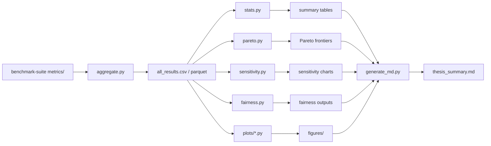
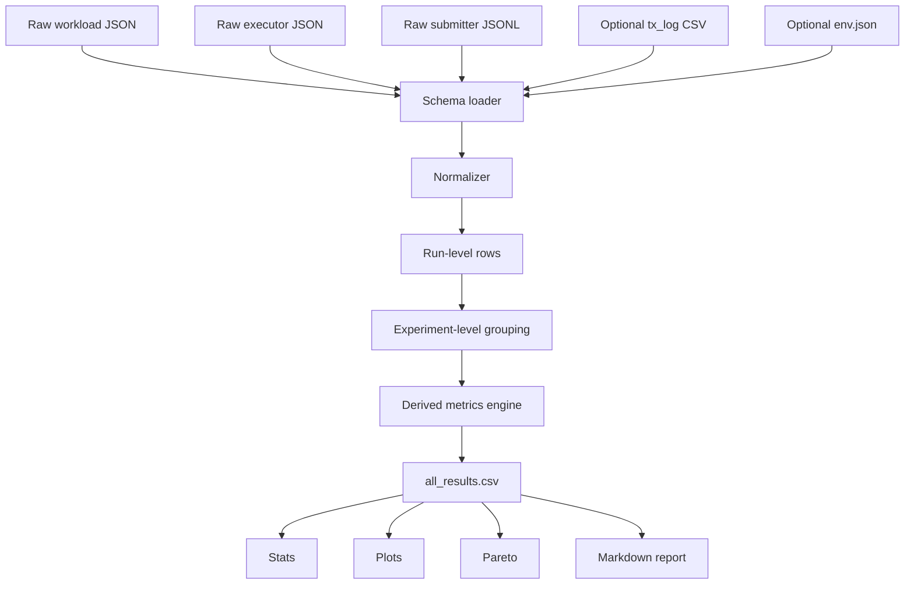
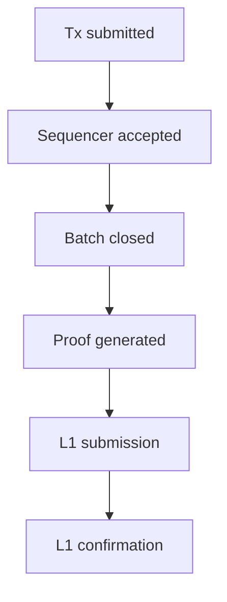
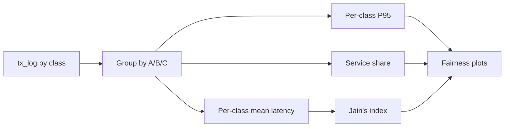
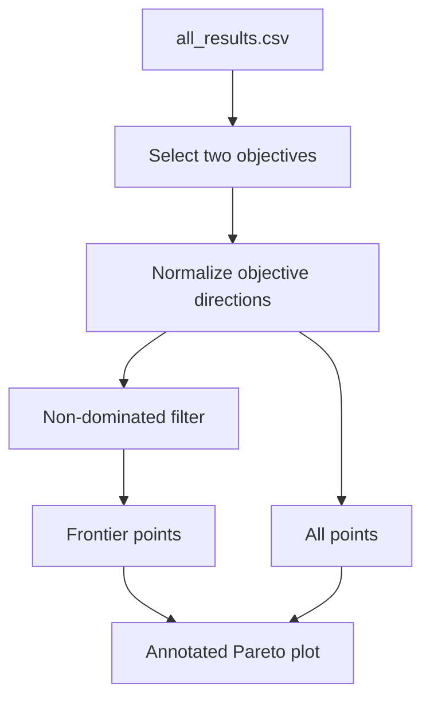
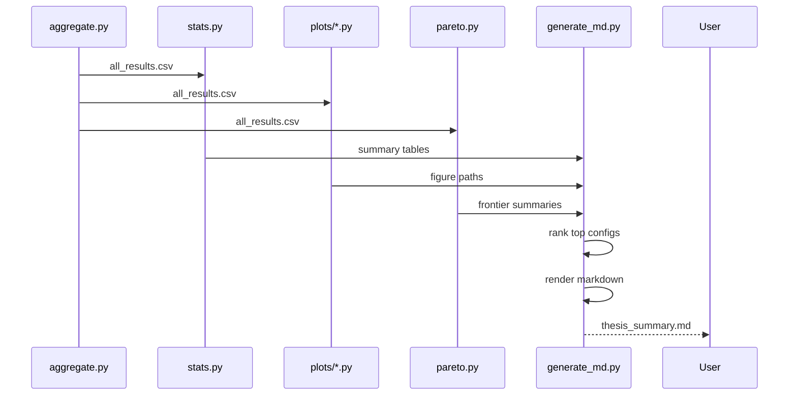

# RollupX Data Tools Methodology and Architecture

## 1. Purpose

This document defines the methodology, architecture, algorithms, data contracts, and visualization flow for the RollupX data-tools subsystem.

The data-tools repo turns raw benchmark artifacts into:
- experiment-level datasets
- statistical summaries
- fairness analyses
- trade-off plots
- thesis-ready markdown summaries

It is the analytical back half of the benchmark pipeline.

## 2. Design basis

This design follows the project documents and benchmark plan:

- the proposal requires throughput, latency, gas cost, proof-generation time, verification time, and data-availability effects to be measured
- the proposal also requires structured collection, repeated experiments, and reproducible analysis
- the progress report adds workload heterogeneity, policy comparison, prover utilization, SLA-aware evaluation, and hypothesis-oriented analysis
- the current benchmark plan defines a metrics contract around workload JSON, executor JSON, and submitter JSONL/metrics files, and proposes tools such as `aggregate.py`, `stats.py`, `pareto.py`, plotting modules, and `generate_md.py`

## 3. Scope

Included:
- ingestion of raw metrics
- schema harmonization
- aggregation
- statistics
- fairness and sensitivity analysis
- Pareto / trade-off analysis
- figure generation
- markdown report generation

Excluded:
- generating raw transactions
- sequencer internals
- prover implementation internals
- on-chain verification internals

## 4. High-level role in the benchmark stack



## 5. Data sources

The data tools ingest artifacts from the benchmark suite and runtime components.

### 5.1 Workload-side inputs

Produced by the generator:
- `workload_<exp_id>.json`
- optional transaction event logs

Purpose:
- offered load
- target rate
- experiment identity
- mix and regime metadata
- total emitted transactions

### 5.2 Executor-side inputs

Produced by the executor / prover layer:
- `executor_<exp_id>.json`

Purpose:
- proof-generation times
- executor-side throughput counters
- prover backend metadata
- commitment / completion counters if available

### 5.3 Submitter-side inputs

Produced by the submitter:
- `submitter_metrics.json` or JSONL batches

Purpose:
- L2→L1 latency
- gas usage or gas saved
- DA mode
- compression ratio
- batch-level timing
- confirmation events

### 5.4 Run-level status files

Recommended:
- `run_status.json`
- `env.json`
- `tx_log_<exp_id>.csv`
- `error.log`

Purpose:
- failure handling
- reproducibility
- richer latency / fairness analysis

## 6. Canonical analytics architecture



## 7. Core modules

### 7.1 `aggregate.py`

Main responsibility:
- walk through all run directories
- read raw files
- normalize schemas
- compute run-level derived metrics
- emit one tidy table

This is the most important module because every other module depends on its output being correct.

### 7.2 `stats.py`

Main responsibility:
- compute grouped descriptive summaries
- report mean, std, median, P95, P99, CI, and counts
- separate descriptive summaries from raw per-event tail analysis

### 7.3 `pareto.py`

Main responsibility:
- compute non-dominated configurations
- identify trade-off frontiers
- support multi-objective comparisons such as throughput vs latency or gas vs latency

### 7.4 Plotting modules

Main responsibility:
- render thesis-ready figures
- use one shared input table
- keep styling consistent
- avoid duplicating schema logic in each plotting file

### 7.5 `generate_md.py`

Main responsibility:
- compile results into a thesis-facing markdown summary
- embed figure references
- highlight top configurations
- preserve reproducibility metadata

## 8. Required analytics outputs

The final analytical layer should produce five classes of outputs.

### 8.1 Descriptive summary tables
Examples:
- mean throughput by batch size
- median proof time by prover
- average gas per batch by DA mode

### 8.2 Tail-behavior summaries
Examples:
- P95 / P99 batch latency
- P95 per-class waiting time
- worst-run summaries

### 8.3 Trade-off outputs
Examples:
- Pareto frontier
- cost vs latency scatter
- throughput vs proof-time curve

### 8.4 Fairness outputs
Examples:
- Jain’s index
- per-class average latency
- per-class P95 latency
- starvation / expired-transaction counts

### 8.5 Report artifacts
Examples:
- `thesis_summary.md`
- tables for chapter 4 / chapter 5
- images for poster / report

## 9. Canonical dataset design

The cleanest design is a **tidy experiment table**: one row per run, plus derived columns.

Recommended columns:

### Identity
- `experiment_id`
- `repeat_id`
- `factor`
- `seed`
- `timestamp`
- `status`

### Configuration
- `batch_size`
- `timeout_ms`
- `policy`
- `da_mode`
- `prover`
- `rate_tps`
- `duration_s`
- `warmup_s`
- `tx_mix`
- `regime`

### Throughput
- `tps_offered`
- `tps_accepted`
- `tps_committed`
- `tps_finalized`

### Latency
- `avg_submit_ms`
- `avg_l2_l1_ms`
- `avg_e2e_ms`
- `p95_submit_ms`
- `p99_submit_ms`
- `p95_l2_l1_ms`
- `p99_l2_l1_ms`

### Proof / compute
- `avg_prove_ms`
- `p95_prove_ms`
- `proof_count`
- `prover_utilization`

### Cost / DA
- `gas_per_batch`
- `gas_per_tx`
- `avg_gas_saved`
- `calldata_bytes`
- `avg_comp_ratio`
- `verification_gas`
- `da_cost_proxy`

### Fairness / robustness
- `jains_index`
- `starvation_count`
- `expired_txs`
- `failed_batches`
- `retry_count`

## 10. Metrics methodology

The proposal and progress report imply that the benchmark should distinguish several stages. The analytics should make them explicit.

### 10.1 Throughput layers


Definitions:
- **Offered TPS**: generated by workload tool
- **Accepted TPS**: admitted by the sequencer
- **Committed TPS**: processed into valid batches / proofs
- **Finalized TPS**: confirmed on L1

This separation prevents false conclusions when the generator offers more load than the system can sustain.

### 10.2 Latency layers



Derived metrics:
- submit latency
- queue waiting time
- proof time
- L2→L1 latency
- end-to-end latency

### 10.3 Cost model support

The progress report defines:

- `Txfee = L2fee + L1fee`
- `L2fee = (ρl2 + δ) × g`
- `L1fee = (ρblob × Scalarblob × btx) + Ctx + Stx`

The analytics layer does not need to predict live chain economics perfectly, but it should compute relative cost indicators consistent with this structure:
- per-tx cost proxies
- per-batch cost proxies
- DA-specific cost comparisons
- proof verification cost if available

## 11. Aggregation algorithm

### Goal

Turn many raw run directories into one canonical results table.

### Algorithm

```text
Input:
    metrics_root = benchmark-suite/metrics/

For each experiment directory E in metrics_root:
    for each repeat directory or run artifact in E:
        load workload JSON
        load executor JSON if present
        load submitter metrics JSONL if present
        load optional tx log if present
        load optional env / status files

        normalize schemas
        compute derived metrics
        attach config metadata
        attach run status

        append one row to master table

Write:
    all_results.csv
    optional all_results.parquet
```

## 12. Normalization strategy

The raw inputs come from different producers. Their schemas may drift.

Normalization should:
- coerce numeric types
- standardize missing fields to `None`
- flatten nested JSON fields
- preserve original raw values where useful
- never silently rename critical contract fields without mapping

Example mapping:
- `workload.details.total_txs -> total_txs`
- `executor.proof_generation_times_ms[] -> proof_times_ms`
- `submitter.line.l2_l1_latency_ms -> batch_l2_l1_ms`

## 13. Derived metric formulas

### 13.1 Offered throughput

```text
tps_offered = total_emitted_txs / measured_duration_s
```

### 13.2 Accepted throughput

```text
tps_accepted = total_accepted_txs / measured_duration_s
```

### 13.3 Committed throughput

```text
tps_committed = total_committed_txs / measured_duration_s
```

### 13.4 Finalized throughput

```text
tps_finalized = total_finalized_txs / measured_duration_s
```

### 13.5 Average proof time

```text
avg_prove_ms = mean(proof_generation_times_ms)
```

### 13.6 Gas per tx

```text
gas_per_tx = total_batch_gas / total_finalized_txs
```

### 13.7 Jain’s fairness index

For values `x1..xn`:

```text
J = (sum(x)^2) / (n * sum(x^2))
```

Recommended application:
- use class-level mean latency or class-level service share
- not just flat per-transaction latencies

## 14. Statistical methodology

The plan calls for repeated experiments. The analysis must treat repeated runs properly.

### Rules
- do not claim significance from a single run
- compute CI using Student’s t-distribution for small `n`
- compute tail percentiles from raw event distributions when possible
- keep run-level summaries and event-level distributions distinct

### Recommended outputs per factor
- mean
- std
- median
- CI95
- valid run count
- failed run count

### Optional stronger layer
- Mann–Whitney U tests for baseline vs comparison
- effect size
- rank-based summaries when distributions are skewed

## 15. Fairness methodology

The progress report makes fairness central to sequencer evaluation.

Recommended fairness outputs:
- per-class mean latency
- per-class P95 latency
- per-class service ratio
- Jain’s fairness index across classes A/B/C
- starvation count
- expired transactions under SLA



## 16. Pareto analysis methodology

The benchmark should expose trade-offs, not only best single metrics.

### Primary frontiers
1. throughput vs latency
2. gas / DA cost vs latency
3. proof time vs throughput

### Recommended method
- use non-dominated filtering
- keep objective direction explicit
- annotate frontier points with configuration labels
- avoid hiding dominated points completely; show them lightly in the background



## 17. Suggested plots

### Essential
- throughput vs latency scatter
- gas / DA cost vs latency scatter
- proof time by prover backend
- throughput bar by policy
- latency CDF from raw data
- fairness heatmap by policy and tx mix

### Optional
- sensitivity tornado chart
- run-to-run variance boxplots
- SLA violation chart
- prover-utilization chart

## 18. Report-generation flow



## 19. Failure handling strategy

The data-tools pipeline should never crash just because one run is incomplete.

### Must handle
- missing executor file
- missing submitter file
- broken JSON line
- missing columns
- failed status
- partially written logs
- zero-throughput run

### Policy
- mark run as failed or partial
- keep row if enough data exists
- fill unavailable derived metrics with `None`
- emit warnings
- continue the rest of the pipeline

## 20. Reproducibility strategy

Recommended metadata per run:
- git commit hashes
- Python version
- OS and machine info
- experiment config snapshot
- seed
- start/end timestamp
- status
- relevant env vars

This is especially important because the proposal explicitly emphasizes reproducibility and structured analysis.

## 21. Test strategy

The data-tools repo should have tests for:

### Aggregation
- complete run
- missing executor file
- missing submitter file
- malformed JSON line
- zero transactions
- failed status file

### Statistics
- percentile correctness
- CI correctness
- small-n handling
- missing-value handling

### Pareto
- dominance detection
- objective direction handling
- duplicate points
- empty inputs

### Reporting
- markdown generation with partial figures
- ranking logic
- missing columns

## 22. Suggested file structure

```text
data-tools/
├── aggregate.py
├── stats.py
├── pareto.py
├── fairness.py
├── sensitivity.py
├── utils/
│   ├── io.py
│   ├── metrics.py
│   ├── stats.py
│   └── schema.py
├── plots/
│   ├── throughput_bar.py
│   ├── latency_cdf.py
│   ├── pareto_frontier.py
│   ├── prover_perf.py
│   └── fairness_heatmap.py
├── report/
│   └── generate_md.py
├── tests/
│   ├── test_aggregate.py
│   ├── test_stats.py
│   ├── test_pareto.py
│   └── test_report.py
└── README.md
```

## 23. Simplification principles

The analytics repo should be powerful, but not bloated.

Good simplifications:
- one canonical loader
- one canonical metrics table
- one shared stats utility
- one shared plotting style
- figures generated from the same dataset
- markdown report built from already-generated artifacts

Avoid:
- each plot re-reading raw JSON independently
- duplicated percentile functions
- plot modules embedding business logic
- magic column names spread across files

## 24. Limitations

- if the upstream metrics contract changes, aggregation must be updated
- some desired metrics like true end-to-end confirmation latency require joinable timestamps from multiple components
- proof-system comparisons are only as good as executor/prover instrumentation
- fairness claims depend on having class labels in tx-level or batch-level logs

## 25. Recommended repository name

The current `data-tools` name is functional, but a more accurate name would reflect analytics, statistics, and reporting rather than generic utilities.

Best options:

1. **rollupx-benchmark-analytics**
   - clearest and most accurate
   - ideal for aggregation, stats, and plots

2. **rollupx-evaluation-lab**
   - slightly broader and more research-oriented

3. **rollupx-results-engine**
   - good if the repo is mostly transformation + reporting

### My recommendation
Use:

- **rollupx-benchmark-analytics**

because it directly matches the repo’s role in the project.
