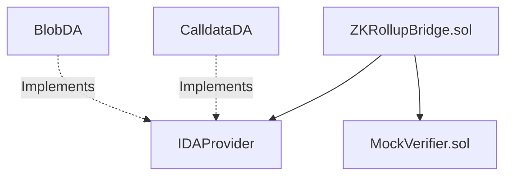
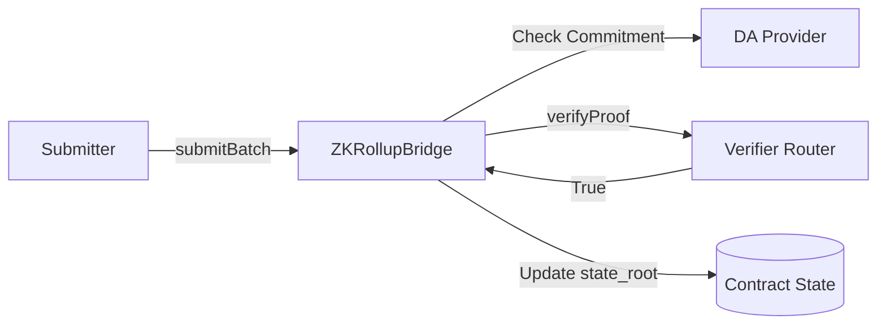
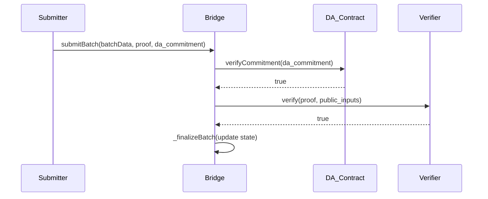

# Smart Contracts

## Contracts Abstract Architecture
**Purpose:** High-level contract relationships.
**Evidence from code:** `contracts/AGENTS.md`

**Explanation:** The Bridge acts as the aggregate root. It delegates data availability checks to swappable DA providers and delegates proof verification to a verifier contract.

## Contracts Detailed Architecture
**Purpose:** Contract interactions and state transitions.
**Evidence from code:** `contracts/AGENTS.md`

**Explanation:** The bridge orchestrates. It does not parse blobs; it simply takes the commitment, queries the DA provider to ensure it matches, verifies the proof, and finalizes the batch.

## Contracts Sequence Diagram
**Purpose:** On-chain batch finalization.
**Evidence from code:** `contracts/AGENTS.md`

**Explanation:** Synchronous execution within a single Ethereum transaction.
