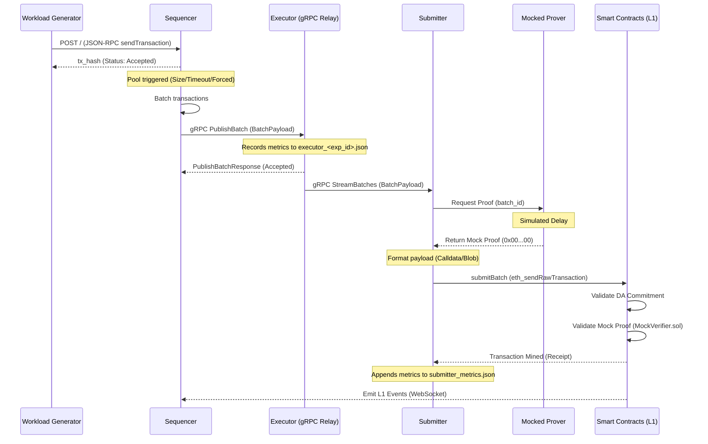

# End-to-End Runtime Flow

This document illustrates the chronological end-to-end execution flow of a transaction, from generation to settlement on L1.

## Transaction Generation

The process begins with the `benchmark-suite/workload/poisson_generator.py` script. It reads configuration parameters (rate, duration, transaction mix) and fires JSON-RPC `sendTransaction` requests at the Sequencer.

These synthetic workloads simulate organic network traffic based on a mathematical Poisson distribution. A unique `experiment_id` is tracked throughout the system for correlation.

## Sequencer Validation and Batching

1.  **Validation:** The Sequencer receives transactions via an HTTP REST endpoint (`sequencer/src/api/server.rs`). It immediately performs pessimistic state validation (e.g., checking nonces, signatures, and balances via `StateCache`). If valid, it returns a `SoftConfirmation` to the generator.
2.  **Pooling:** Valid transactions are queued into a `TransactionPool`. High-priority L1 forced transactions (e.g., deposits) enter a `ForcedQueue`.
3.  **Orchestration:** An asynchronous `BatchOrchestrator` (`sequencer/src/batch/orchestrator.rs`) continually monitors triggers (batch size threshold, timeout interval, presence of forced transactions).
4.  **Sealing:** Once triggered, the orchestrator pulls transactions, orders them according to the configured scheduling policy (FCFS, TimeBoost, etc.), and seals them into a `Batch`.
5.  **Publishing:** The sealed `BatchPayload` is dispatched over gRPC to the Executor using the `publish_batch` RPC call (`sequencer/src/proto/rollup.proto`).
6.  **Persistence:** Batch metadata is stored in an internal SQLite registry (`sequencer.db`).

## Executor Relay (gRPC Mode)

Currently, the Executor operates primarily in a `grpc` relay mode (`executor/src/grpc.rs`).

1.  **Receiving:** The `ExecutorGrpcService` receives the `BatchPayload` from the Sequencer.
2.  **Broadcasting:** It immediately sends the payload into a `broadcast::channel`.
3.  **Metrics:** It spawns an asynchronous task to record metrics (e.g., `batch_count`, `received_tx_count`, `duration_s`) locally and periodically flushes them to an `executor_<exp_id>.json` file in the configured `METRICS_ROOT`. Note that proof generation timings are intentionally zeroed out as no execution/proving occurs in this mode.
4.  **Streaming:** The Submitter connects to the Executor via the `stream_batches` RPC and consumes the broadcasted payloads.

*(Note: There is a legacy `bridge` mode defined in `executor/src/bridge.rs` which reads JSON files and attempts to run a `BatchProcessor` wrapping an EraVM state machine. However, this path currently lacks pre-compiled `Bootloader.zbin` artifacts required for execution.)*

## Mocked Proving

The Prover subsystem is completely simulated.

When the Submitter needs a proof for a batch, it queries a `MockProofProvider` (or similar HTTP stub). The mock provider waits for a configured delay (simulating computational effort) and returns a fixed string of zero-bytes (`0x00...00`).

## Submitter Workflow

The Submitter (`submitter/src/daemon.rs`) manages the resilient submission of batches to the Ethereum L1.

1.  **Ingestion:** It pulls pending `BatchPayload` streams from the Executor.
2.  **Saga Pattern:** The Submitter employs a robust Saga pattern backed by an internal database (SQLite/Postgres) to track state transitions (`RECEIVED_FROM_EXECUTOR`, `COMPRESSED`, `SUBMITTED_TO_L1`, `CONFIRMED_ON_L1`). This ensures crash recovery and prevents duplicate submissions.
3.  **DA Formatting:** The payload is compressed and formatted according to the configured Data Availability strategy (`Calldata`, `Blob`/EIP-4844, or `OffChain`).
4.  **Submission:** The data and mock proof are sent via `eth_sendRawTransaction` to the `ZKRollupBridge` smart contract on the Hardhat node. It handles gas bumping if the transaction stalls.
5.  **Metrics:** Upon successful submission (or off-chain simulation), it appends telemetry (e.g., latency, gas used, DA mode) to a JSONL file (`submitter_metrics.json`) in the `METRICS_ROOT`.

## L1 Settlement

1.  **Bridge Verification:** The `ZKRollupBridge.sol` contract receives the `commitBatch` call.
2.  **DA Commitment:** It validates the DA commitment against the configured provider (`CalldataDA`, `BlobDA`, etc.).
3.  **Proof Verification:** It queries a verifier contract. In the local testing environment, it delegates to `MockVerifier.sol`, which blindly returns `true` for any mock proof.
4.  **State Update:** The bridge updates the L2 state root and emits a `BatchCommitted` event (which the Sequencer monitors for L1 deposits/exits).

## Sequence Diagram

