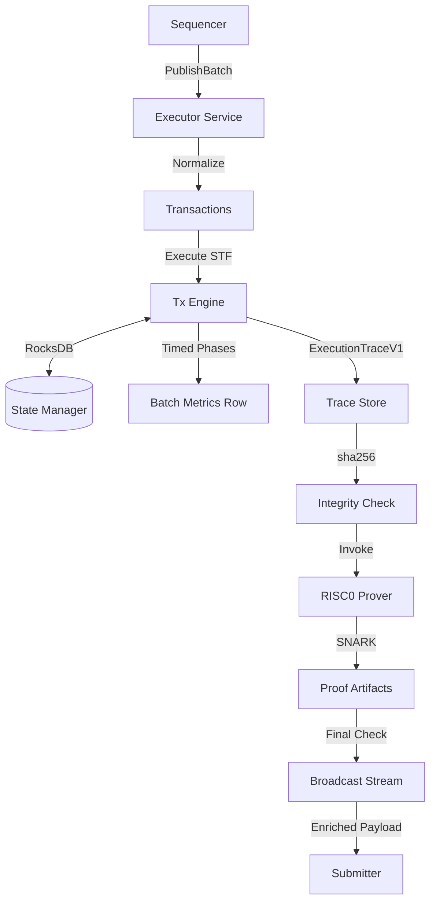

# Executor

Executor is the host-side state transition and proving coordinator.

## Runtime Flow (`service.rs`)

For each gRPC `publish_batch` request:

1. Parse and normalize sequencer batch transactions.
2. Execute STF using `SimpleTransactionEngine` over `RocksDbStateManager`.
3. Build `ExecutionTraceV1` (public inputs, tx outcomes, state diffs).
4. Persist trace and verify persisted SHA-256.
5. Invoke prover backend (`risc0`) to generate proof artifacts.
6. Build enriched batch payload (DA commitment + proof) and broadcast to submitter stream.
7. Append lifecycle status transitions: `generated -> persisted -> proved -> published`.

Core files:
- `executor/src/service.rs`
- `executor/src/tx_engine.rs`
- `executor/src/proof.rs`
- `executor/src/trace.rs`

## Prover Backend

Only `risc0` is supported in the current executor codepath (`PROVER_BACKEND=risc0`).

Required env:
- `RISC0_HOST_BIN`

Optional env:
- `RISC0_GUEST_ELF`
- `RISC0_WORK_DIR` (default `tmp/risc0`)
- `ALLOW_PROOF_FALLBACK` (default strict off; set to `1` only if you intentionally allow non-groth16 proof mode)
- `ALLOW_UNSIGNED_USER_TXS` (default strict off; set to `1` for synthetic unsigned user-transaction experiments)

**Explanation:** The Executor maintains a strict cryptographic link between the input batch, the internal state transitions, and the final ZK proof. Every step of this pipeline is instrumented for research analysis.

## Research & Metrics Mapping

| Research Goal | Executor Metric | Interpretation |
| :--- | :--- | :--- |
| **STF Performance** | `total_execution_ms` | Baseline cost of rollup execution without ZK overhead. |
| **State Scalability**| `merkle_update_ms` | Direct measure of Sparse Merkle Tree (SMT) bottleneck as state grows. |
| **Prover Latency** | `total_prover_wall_ms`| The "Proving Time" bottleneck in ZK-rollup finality. |
| **Storage Cost** | `state_diff_bytes` | Predicts L1 Data Availability (DA) costs for state-diff rollups. |
| **Auditability** | `trace_id` | Unique handle for cross-referencing L1 settlements with local execution. |

## Inputs and Outputs

Inputs:
- gRPC `BatchPayload` from sequencer.

Outputs:
- gRPC `StreamBatches` enriched payload for submitter.
- Trace files under `TRACE_ROOT`.
- Proof/journal/metadata artifacts under `RISC0_WORK_DIR`.

## State and Trace Guarantees

- Trace hash is verified immediately after persistence.
- Prover metadata checks include:
  - trace hash match,
  - expected public input hash match,
  - journal/proof size and hash integrity.

If any check fails, batch publication fails fast.
