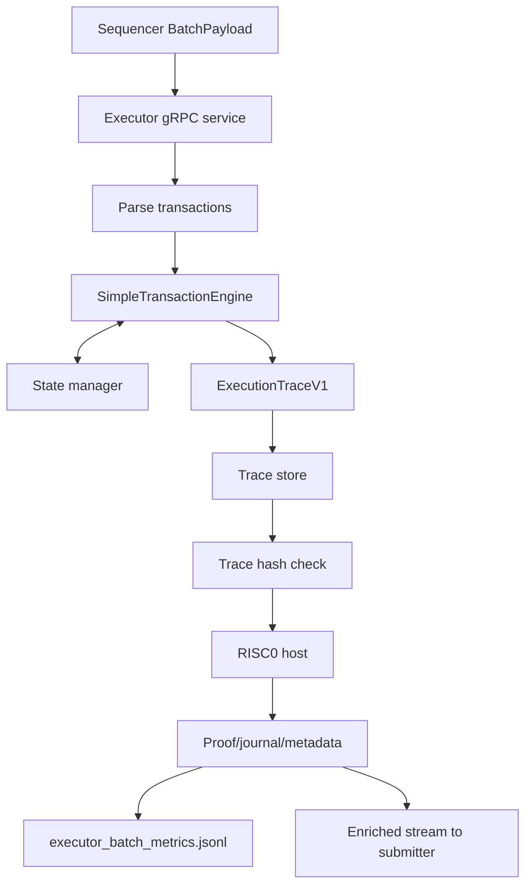

# Executor

The executor is the host-side state transition and proof coordinator. It receives sealed batches from the sequencer, executes the repository's simplified transfer-centric STF, writes traces, invokes the RISC0 proof path, emits metrics, and streams enriched batches to the submitter.

## Runtime Flow

Core files:

- `executor/src/service.rs`
- `executor/src/tx_engine.rs`
- `executor/src/state.rs`
- `executor/src/trace.rs`
- `executor/src/proof.rs`

## Execution Semantics

The current STF:

1. Verifies user signatures.
2. Checks nonce and balance.
3. Applies transfer-style state changes.
4. Emits sender/receiver state diffs.
5. Computes a lightweight root.
6. Builds a trace with phase timing.

It is not an EVM-equivalent execution engine. It is valid as a controlled synthetic execution model.

## Proof Path

The executor writes a converted trace for `risc0_prover`, invokes the RISC0 host, and verifies artifact metadata before publishing. The proof statement covers replay consistency of simplified state diffs from initial root to final root.

Important env variables:

- `PROVER_BACKEND`
- `RISC0_HOST_BIN`
- `RISC0_WORK_DIR`
- `ALLOW_PROOF_FALLBACK`

## Metrics Mapping

| Research question | Executor fields | Notes |
|---|---|---|
| STF cost | `total_execution_ms`, execution phase fields | Local host timing. |
| State workload | `state_diff_count`, `state_diff_bytes`, `unique_touched_accounts` | Synthetic transfer model. |
| Proof bottleneck | `total_proof_ms`, `prover_metrics` | Can dominate strict runs. |
| Artifact size | `proof_bytes`, `journal_bytes` | Circuit-specific. |
| Trace auditability | `trace_id`, lifecycle index | Links local trace/proof artifacts. |

## Validity Notes

Executor metrics can lag sequencer metrics by minutes when real proof work is enabled. For research claims about full throughput, require nonzero executor rows and batch-id catch-up, not only workload success.

