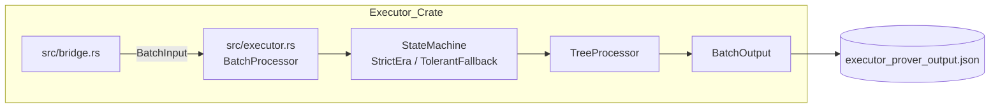
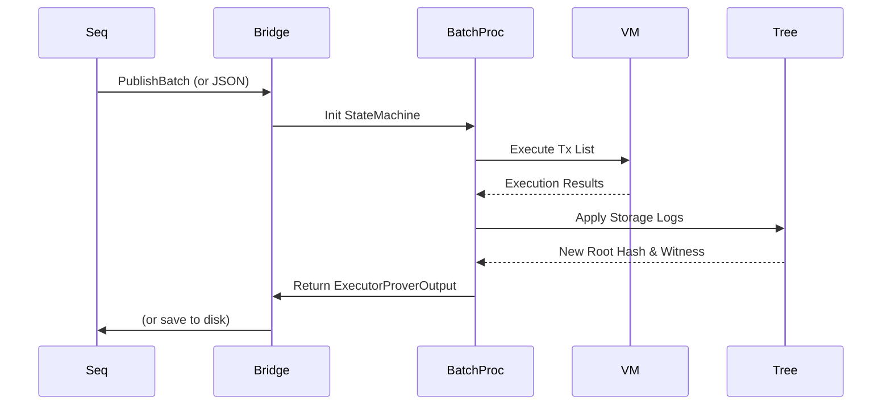

# Executor

The Executor takes raw transactions from the Sequencer, processes them, updates the state tree, and returns cryptographic proofs of execution.

**Crucial Architecture Note:** The `executor` microservice has two distinct modes of operation set via the `EXECUTOR_MODE` environment variable (`executor/src/main.rs`).
1. `grpc` (Default): Operates strictly as a pass-through relay. It exposes a `PublishBatch` endpoint to the Sequencer, logs telemetry (`executor_<exp_id>.json`), and immediately broadcasts the payload via a channel to a `StreamBatches` endpoint for the Submitter.
2. `bridge` (Legacy): Runs the full EraVM `BatchProcessor` logic reading from files, updating the state root, and outputting to `executor_prover_output.json`. However, this mode currently fails testing because `Bootloader.zbin` artifacts are missing from the repository.

## Executor Abstract Architecture (Legacy `bridge` Mode)
**Purpose:** High-level state transition layer.
**Evidence from code:** `executor/SYSTEM_DESIGN.md`

```mermaid
flowchart TD
    SEQ[Sequencer] --> IN[Bridge / gRPC Receiver]
    IN --> MACH[State Machine (EraVM)]
    MACH --> TREE[Merkle Tree Processor]
    TREE --> OUT[Batch Output / Stream]
```

## Executor Detailed Architecture
**Purpose:** File-level module breakdown.
**Evidence from code:** `executor/src/bridge.rs`, `executor/src/executor.rs`



## Executor Sequence Diagram (Legacy `bridge` Mode)
**Purpose:** Internal execution loop.
**Evidence from code:** `executor/SYSTEM_DESIGN.md`



## Current Relay Flow (`grpc` Mode)
**Evidence from code:** `executor/src/grpc.rs`
1. The Sequencer sends `PublishBatch`.
2. The Executor writes `executor_<exp_id>.json` metrics (duration, batch_count, tx_count).
3. The Executor pushes the raw `BatchPayload` to a broadcast channel.
4. The Submitter consumes `StreamBatches` from the channel.
5. No proof generation occurs.
