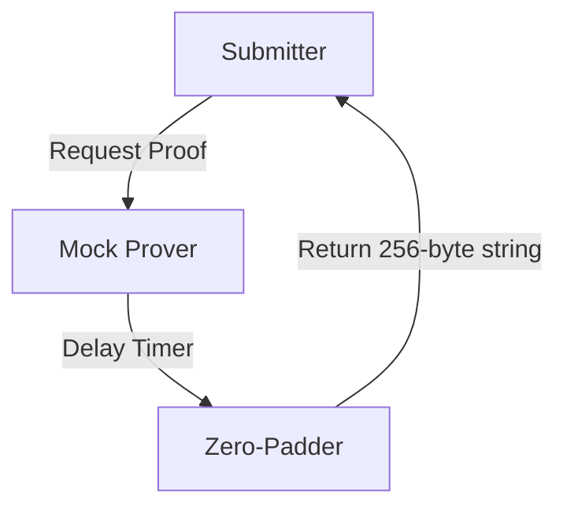
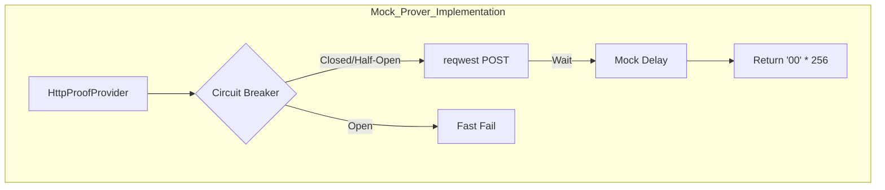
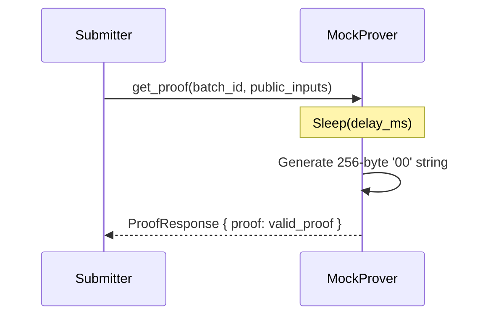

# Prover Subsystem (Mocked)

**CRITICAL NOTE:** The Prover is currently implemented as a **Mock/Stub**. There is no real ZK proof generation occurring in the end-to-end pipeline. The diagrams below reflect the implemented mock behavior.

## Prover Abstract Architecture
**Purpose:** Show the simulated proof generation process.
**Evidence from code:** `submitter/src/infrastructure/prover_mock.rs`, `Zk-Prover/rollup-prover/core/bin/prover/src/dummy_prover.rs`

**Explanation:** When asked for a proof, the mock system simply waits and returns fixed bytes to satisfy L1 size requirements.

## Prover Detailed Architecture
**Purpose:** Detail how the mocked prover handles requests.
**Evidence from code:** `submitter/src/infrastructure/prover_http.rs`, `submitter/src/application/proof_manager.rs` (inferred from HTTP provider error handling)

**Explanation:** The Submitter uses a robust HTTP client with a Circuit Breaker to talk to the Prover. However, the endpoint it talks to simply returns a mocked zero-string.

## Prover Sequence Diagram
**Purpose:** Flow of a mocked proof request.
**Evidence from code:** `submitter/src/infrastructure/prover_mock.rs`

**Explanation:** The delay simulates the computational time of a real Prover without doing any real work.
