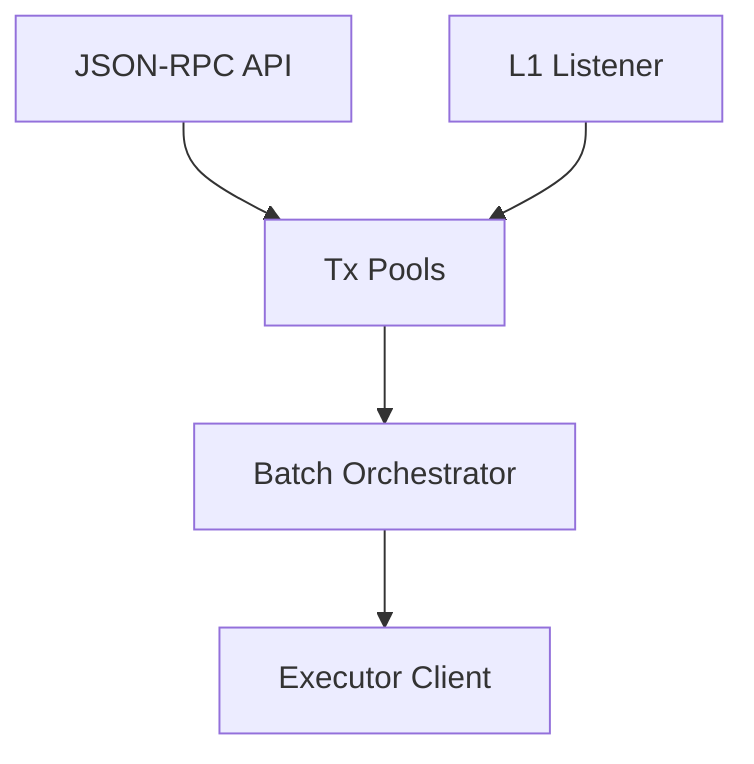
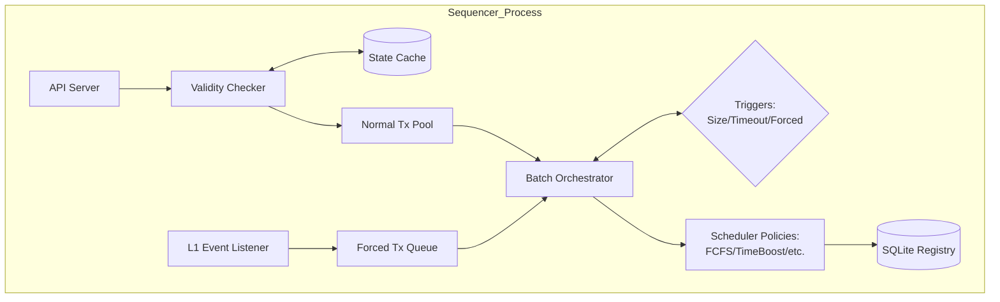
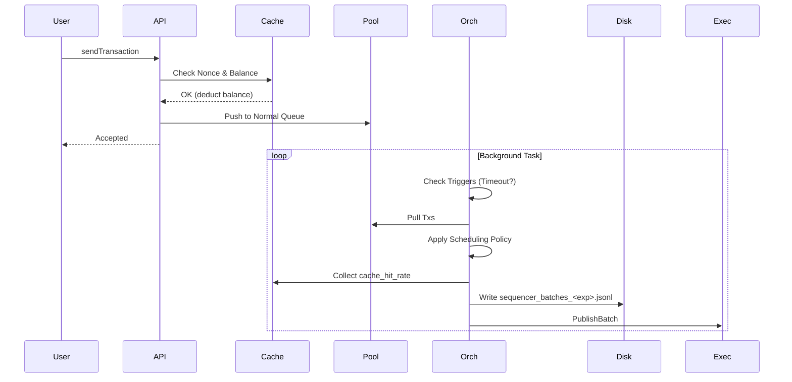

# Sequencer

## Sequencer Abstract Architecture
**Purpose:** High-level view of Sequencer responsibilities.
**Evidence from code:** `sequencer/src/main.rs`, `sequencer/README.md`

**Explanation:** The Sequencer ingests from users and L1, queues them, orders them via a scheduler, and dispatches batches to the Executor.

## Sequencer Detailed Architecture
**Purpose:** Internal breakdown of the Sequencer.
**Evidence from code:** `sequencer/src/main.rs`, `sequencer/src/pool/`, `sequencer/src/scheduler/`

**Explanation:** The Validty Checker strictly uses pessimistic balance tracking against the State Cache. Triggers dictate when the Orchestrator pulls from the queues and applies the active Strategy pattern scheduling policy.

## Sequencer Sequence Diagram
**Purpose:** Transaction lifecycle inside the Sequencer.
**Evidence from code:** `sequencer/src/main.rs`

**Explanation:** User interaction is isolated from batch creation. Validation is instantaneous, while batching happens asynchronously. Every batch cycle logs its own performance and fairness metrics to disk for later analysis.

## Research & Metrics Mapping

The metrics collected by the Sequencer directly feed into the project's research questions (RQs):

| Research Goal | Sequencer Metric | Interpretation |
| :--- | :--- | :--- |
| **System Fairness** | `jains_fairness_index` | 1.0 = Perfect fairness. Lower values indicate policy bias. |
| **User Experience** | `wait_time_p95_ms` | Predictability of confirmation times for regular users. |
| **MEV / Efficiency** | `ordering_efficiency` | How well the policy captures available fee revenue compared to pure FeePriority. |
| **System Stability** | `cache_hit_rate` | Efficiency of the pessimistic balance tracking mechanism. |
| **Network Cost** | `raw_tx_bytes` | Drives the L1 DA costs in the overall system feasibility study. |
