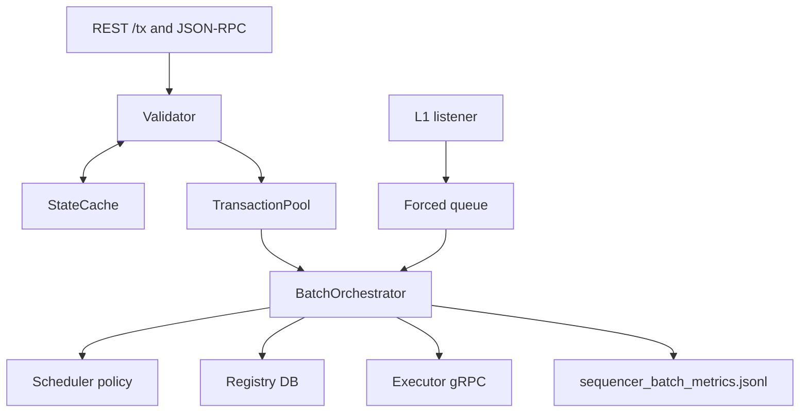

# Sequencer

The sequencer is the front-door and batching component for RollupX benchmarks. It accepts benchmark transactions, validates them against local state, stores them in a pool, seals batches, records per-batch metrics, and publishes batches to the executor.

## Runtime Architecture

Core files:

- `sequencer/src/api/server.rs`
- `sequencer/src/validation/validator.rs`
- `sequencer/src/state/cache.rs`
- `sequencer/src/pool/tx_pool.rs`
- `sequencer/src/batch/orchestrator.rs`
- `sequencer/src/scheduler/policies.rs`

## Transaction Lifecycle

1. The benchmark posts a signed transaction to `/tx`.
2. The validator checks signature, nonce, and balance.
3. The state cache is pessimistically updated on acceptance.
4. The transaction enters the normal pool with arrival timestamps.
5. The orchestrator seals a batch on size, timeout, or forced-transaction trigger.
6. The selected policy orders/selects transactions.
7. Batch metrics are appended to `sequencer_batch_metrics.jsonl`.
8. The batch is published to executor.

## Scheduling Policies

| Policy | Design |
|---|---|
| `FCFS` | Preserve arrival order. |
| `FeePriority` | Prefer higher gas price. |
| `TimeBoost` | Use time window, boost bid, then gas price. |
| `FairBFT` | Single-node timestamp-order approximation. |
| `BlobPacking` | Nonce-safe fill-first greedy packing by estimated encoded bytes. |

## BlobPacking

`BlobPacking` is implemented in `TransactionPool::take_blob_packed_nonce_safe`. It reads expected nonces from `StateCache`, builds a contiguous eligible nonce prefix per sender, greedily selects larger eligible transactions that fit the blob byte budget, and restores unselected transactions in original arrival order.

Metrics emitted for this policy:

- `blob_selected_bytes`
- `blob_eligible_bytes`
- `blob_eligible_tx_count`
- `blob_ineligible_nonce_gap_count`
- `blob_nonce_chain_truncated_senders`
- `blob_low_fill_reason`

## Metrics Mapping

| Research question | Sequencer fields | Notes |
|---|---|---|
| Batch latency | `wait_time_p50_ms`, `wait_time_p95_ms`, `wait_time_mean_ms` | In-batch wait distribution. |
| Batch fill | `tx_count`, `estimated_batch_bytes`, `blob_utilization` | Serialized-size proxy. |
| Scheduling behavior | `scheduling_policy`, `ordering_efficiency`, `reordering_events` | Proxy metrics, not MEV proof. |
| State-cache health | `cache_hit_rate`, `stale_nonce_rejections`, `cache_age_ms` | Depends on correct reset/seeding. |
| Blob scheduling | `blob_*` fields | Meaningful only under `BlobPacking`. |

## Validity Notes

The sequencer is strong for measuring local admission, batching, and policy behavior. It does not by itself validate full end-to-end throughput; executor and submitter metrics must also catch up for pipeline claims.

