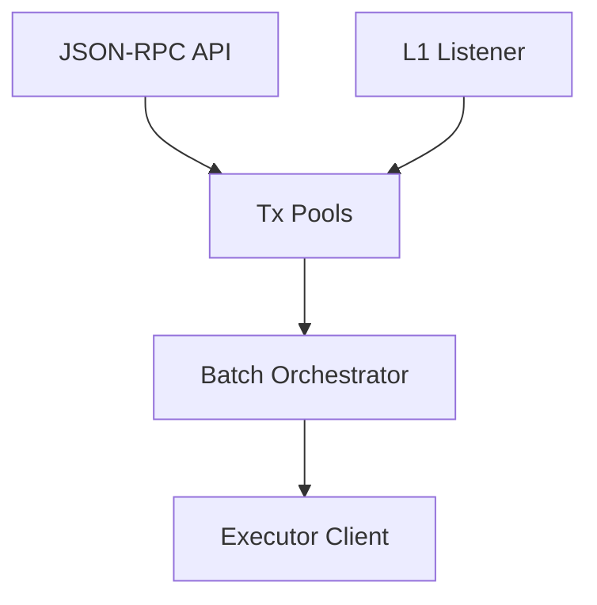
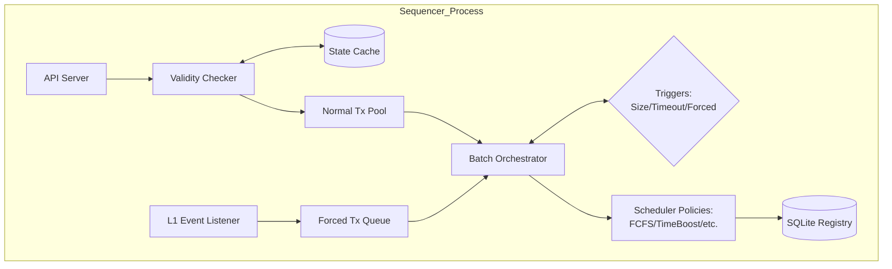
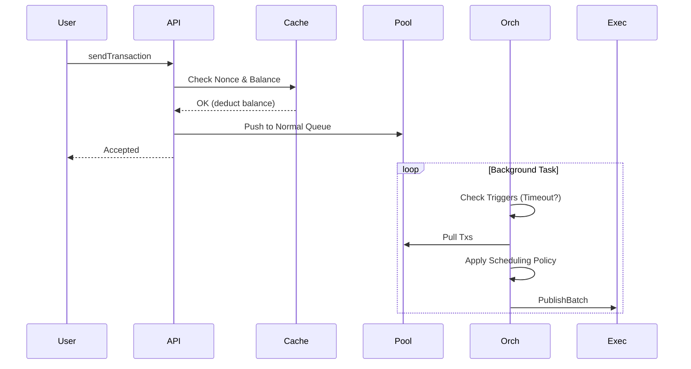

# Sequencer

## Sequencer Abstract Architecture
**Purpose:** High-level view of Sequencer responsibilities.
**Evidence from code:** `sequencer/src/main.rs`, `sequencer/README.md`

**Explanation:** The Sequencer ingests from users and L1, queues them, orders them via a scheduler, and dispatches batches to the Executor.

## Sequencer Detailed Architecture
**Purpose:** Internal breakdown of the Sequencer.
**Evidence from code:** `sequencer/src/main.rs`, `sequencer/src/pool/`, `sequencer/src/scheduler/`

**Explanation:** The Validty Checker strictly uses pessimistic balance tracking against the State Cache. Triggers dictate when the Orchestrator pulls from the queues and applies the active Strategy pattern scheduling policy.

## Sequencer Sequence Diagram
**Purpose:** Transaction lifecycle inside the Sequencer.
**Evidence from code:** `sequencer/src/main.rs`

**Explanation:** User interaction is isolated from batch creation. Validation is instantaneous, while batching happens asynchronously.
