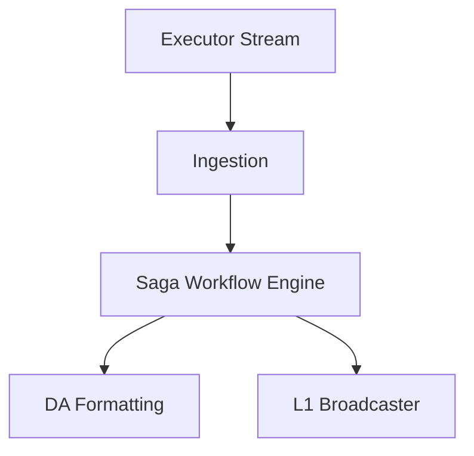
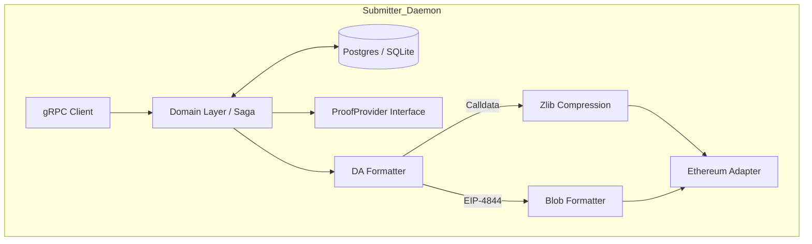
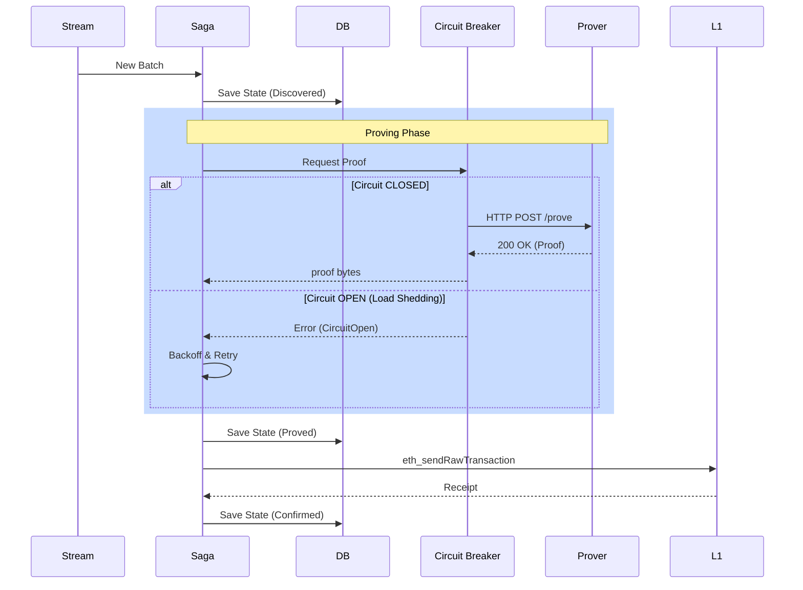

# Submitter

## Submitter Abstract Architecture
**Purpose:** Overview of the batch submission process.
**Evidence from code:** `submitter/README.md`, `submitter/src/submitter.rs`

**Explanation:** The Submitter pulls execution results and uses a robust Saga pattern to ensure Data Availability and Proofs are securely and reliably posted to L1.

## Submitter Detailed Architecture
**Purpose:** Internal DDD structure of the Submitter.
**Evidence from code:** `submitter/src/infrastructure/`

**Explanation:** Follows Hexagonal Architecture. The domain logic dictates the workflow (fetch proof -> format DA -> send tx), utilizing adapters for storage, proving, and Ethereum RPC.

## Submitter Sequence Diagram
**Purpose:** The Saga execution loop.
**Evidence from code:** `submitter/src/infrastructure/prover_http.rs`, `submitter/README.md`

**Explanation:** The Submitter implements a robust Saga loop with a built-in Circuit Breaker to prevent overwhelming a struggling prover. Every state transition is persisted to the database, allowing the service to resume seamlessly after a crash.

## Research & Metrics Mapping

| Research Goal | Submitter Metric | Interpretation |
| :--- | :--- | :--- |
| **System Finality** | `batch_e2e_duration_seconds` | Primary measure of L2 -> L1 settlement latency. |
| **System Stability** | `prover_circuit_tripped_total` | Frequency of prover outages or overload events. |
| **DA Efficiency** | `tx_submitted_total` | Comparative analysis of Calldata vs. Blob frequency. |
| **Operational Cost** | `gas_used` (logs) | Direct projection of L1 operational overhead. |
| **Fault Tolerance** | `batches_failed_permanent_total`| System reliability floor (Dead Letter Queue rate). |
