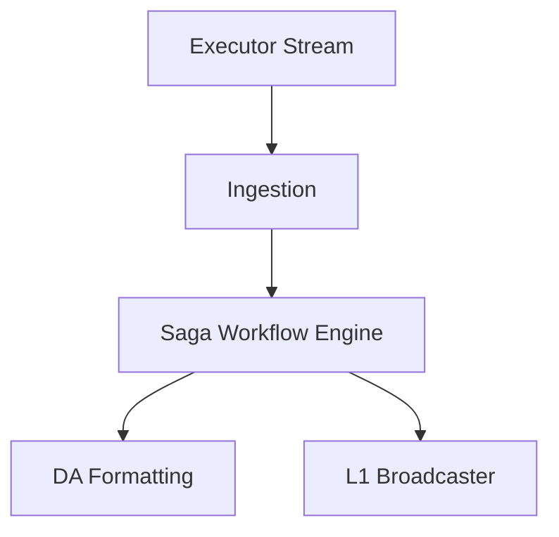
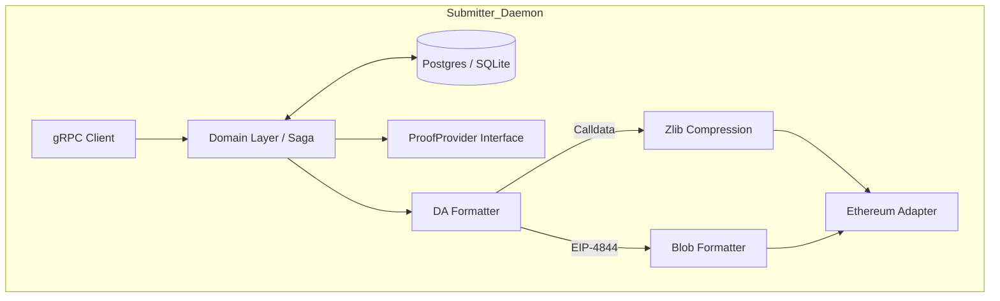
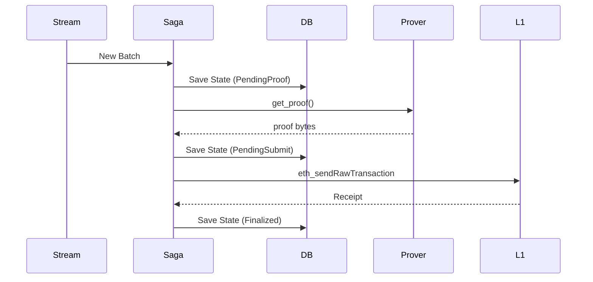

# Submitter

## Submitter Abstract Architecture
**Purpose:** Overview of the batch submission process.
**Evidence from code:** `submitter/README.md`, `submitter/src/submitter.rs`

**Explanation:** The Submitter pulls execution results and uses a robust Saga pattern to ensure Data Availability and Proofs are securely and reliably posted to L1.

## Submitter Detailed Architecture
**Purpose:** Internal DDD structure of the Submitter.
**Evidence from code:** `submitter/src/infrastructure/`

**Explanation:** Follows Hexagonal Architecture. The domain logic dictates the workflow (fetch proof -> format DA -> send tx), utilizing adapters for storage, proving, and Ethereum RPC.

## Submitter Sequence Diagram
**Purpose:** The Saga execution loop.
**Evidence from code:** `submitter/src/infrastructure/prover_http.rs`, `submitter/README.md`

**Explanation:** Every step of the pipeline is checkpointed to the database, ensuring crash-recovery and preventing double-submission.
