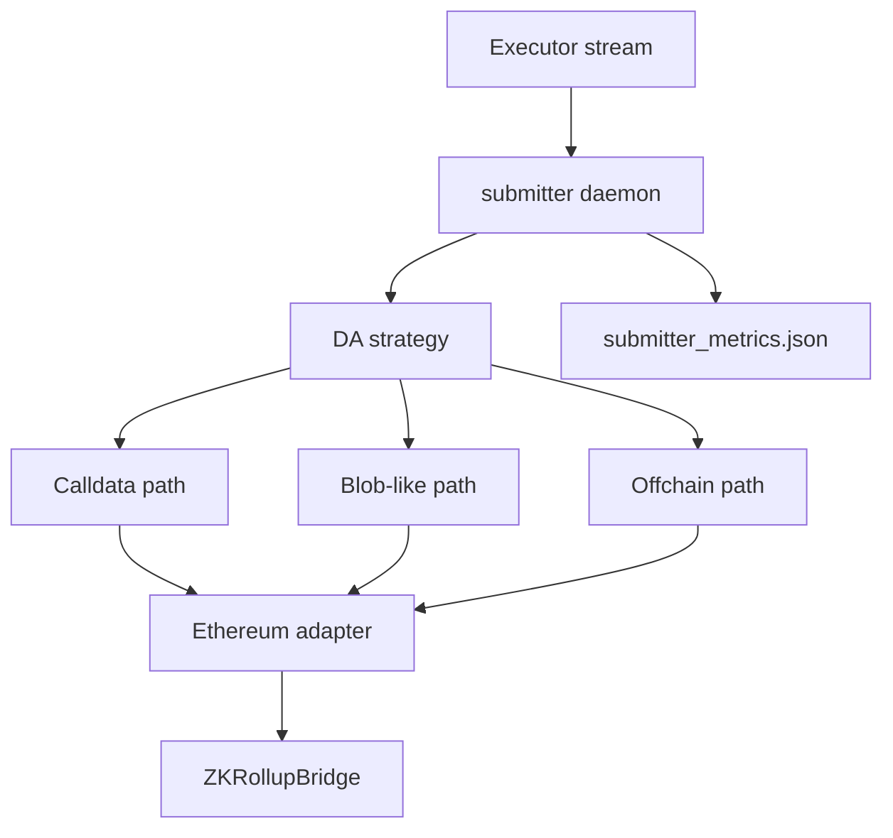

# Submitter

The submitter receives executor-enriched batches, applies the selected data-availability strategy, submits to the local bridge, and records settlement/cost metrics.

## Runtime Architecture

Core files:

- `submitter/src/daemon.rs`
- `submitter/src/infrastructure/da_calldata.rs`
- `submitter/src/infrastructure/da_blob.rs`
- `submitter/src/infrastructure/da_offchain.rs`
- `submitter/src/infrastructure/ethereum_adapter.rs`
- `submitter/src/domain/cost_breakdown.rs`

## DA Modes

| Mode | Meaning |
|---|---|
| `calldata` | Batch payload is submitted through calldata-style path. |
| `blob` | Blob-like path records blob metadata and estimated/measured blob cost provenance. |
| `offchain` | Stores data locally and submits a pointer/commitment; simulated DA. |

## Metrics Mapping

Rows are appended to `submitter_metrics.json` as JSONL.

| Research question | Submitter fields | Notes |
|---|---|---|
| Settlement latency | `submission_latency_ms`, `l2_l1_latency_ms`, `soft_commit_ms`, `hard_finality_ms` | Local Hardhat timing only. |
| DA size/fill | `batch_data_bytes`, `compressed_bytes`, `blob_count`, `blob_utilization` | Depends on DA mode. |
| Cost | `l1_gas_used`, `total_cost_wei`, `cost_per_tx_wei`, USD fields | Use provenance fields. |
| Blob validity | `real_eip4844_blob`, `blob_cost_source`, `measured_blob_gas_used` | Required for real blob claims. |
| Reliability | `submission_status`, `error`, `gas_bumped`, `gas_bump_count` | Filter failures and bumped rows where needed. |

## Validity Notes

Submitter data is required for L1/cost claims. If a smoke run reports missing submitter metrics or skipped L1 validation, the result is not a full end-to-end settlement result.

