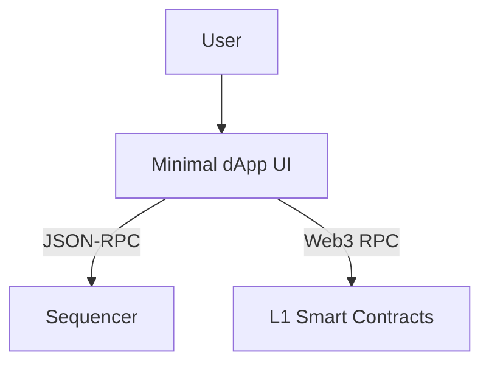

# UI Component

*(Note: Codebase analysis shows the UI is a minimal, partially implemented stub. `zk-rollup-ui/` lacks source files, only a README exists).*

## UI Abstract Architecture
**Purpose:** Provide a frontend to deposit, transfer, withdraw, and inspect L2 state.
**Evidence from code:** `zk-rollup-ui/README.md`

**Explanation:** The UI is intended to send transactions to the Sequencer and read L1 state for deposits/withdrawals.
**Key assumptions:** Component is essentially a placeholder in the current repository state.
