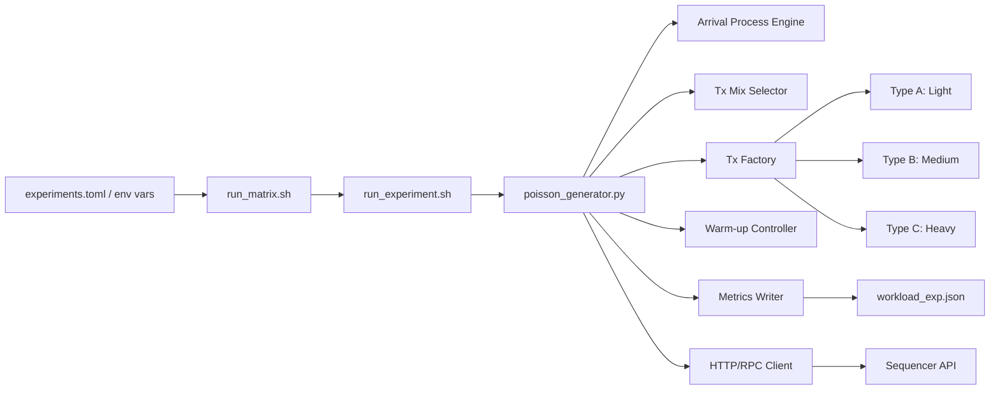
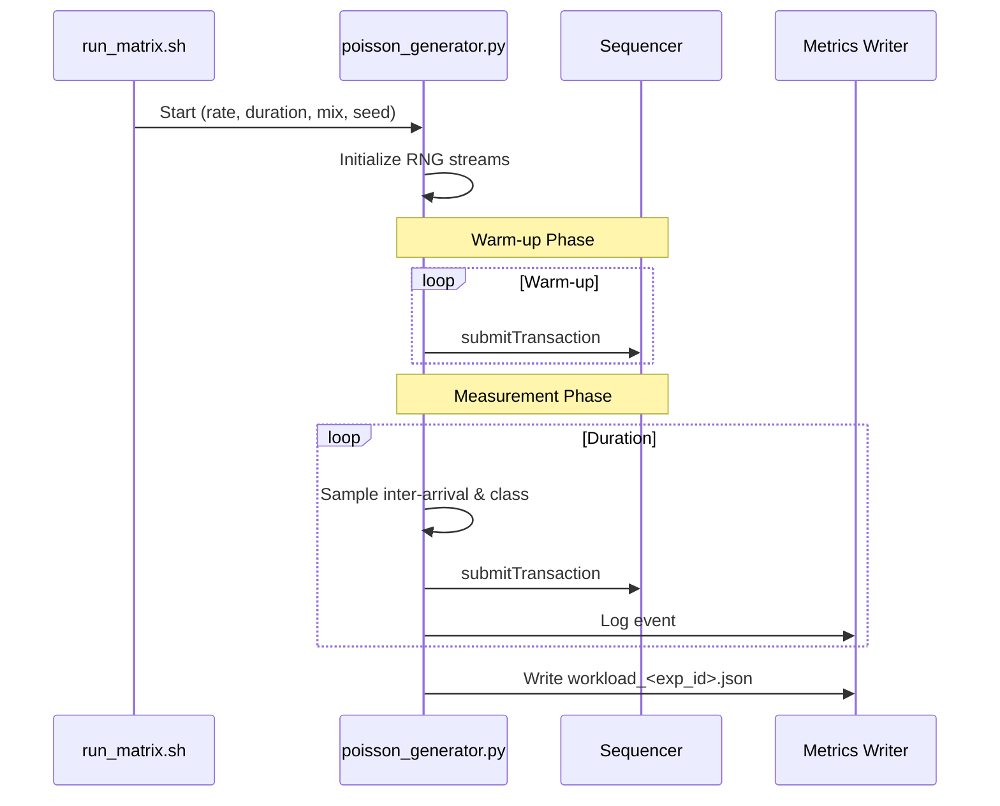

# Workload Generator / Benchmark Suite

The RollupX workload generator is a Python-based subsystem designed to produce controlled, reproducible, and heterogeneous transaction streams. It is the primary driver for all system-level benchmarks.

## Architecture

The generator operates as a standalone process that interacts with the Sequencer via JSON-RPC. It is orchestrated by the `benchmark-suite` scripts to ensure consistency across experimental runs.



### Core Components

- **Arrival Process Engine**: Implements a Poisson arrival process. Inter-arrival times are sampled from an exponential distribution based on the target `rate_tps`.
- **Tx Mix Selector**: Selects the transaction class (A, B, or C) for each arrival based on configured presets (e.g., `balanced`, `light`, `heavy`).
- **Tx Factory**: Constructs valid, signed Ethereum-like transactions with class-specific properties (gas limits, calldata size, and resource weights).
- **Warm-up Controller**: Executes an unmeasured initial phase to bring the system (and its caches/queues) into a steady state.
- **Metrics Writer**: Logs workload-side telemetry, including actual emission counts and timestamps.

## Transaction Types (Heterogeneity)

The system avoids uniform synthetic traffic by defining three distinct transaction classes:

| Type | Name | Purpose | Profile |
|------|------|---------|---------|
| **A** | Light | Background load | Low gas, low calldata, fast proving. |
| **B** | Medium | Typical activity | Moderate gas (ERC-20), moderate calldata. |
| **C** | Heavy | Stressor | High gas (Complex call), large calldata, heavy proving. |

### Mix Presets

| Preset | Type A | Type B | Type C | Purpose |
|--------|--------|--------|--------|---------|
| `balanced` | 70% | 20% | 10% | Steady-state baseline. |
| `light` | 95% | 4% | 1% | High-volume simple transfers. |
| `heavy` | 20% | 30% | 50% | Prover and DA stress testing. |

## Reproducibility and RNG Strategy

To ensure experiments are statistically rigorous and reproducible, the generator uses independent Random Number Generator (RNG) streams for different subsystems:

1. `rng_arrival`: Controls timing between transactions.
2. `rng_mix`: Controls the sequence of transaction classes.
3. `rng_factory`: Controls internal payload variation.

By splitting these streams, changes to one factor (e.g., transaction payload size) do not unintentionally shift the arrival timing of transactions, allowing for clean isolation of variables.

## Lifecycle



## Usage and CLI

The generator is typically invoked via `run_matrix.sh`, but can be run manually for debugging:

```bash
python3 benchmark-suite/workload/poisson_generator.py \
    --experiment_id my_test \
    --rate 10 \
    --duration 60 \
    --warmup 10 \
    --seed 42 \
    --tx_mix balanced \
    --host localhost \
    --port 3000
```
