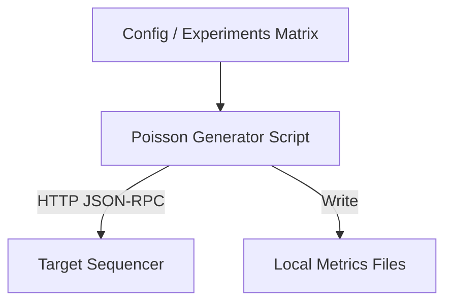
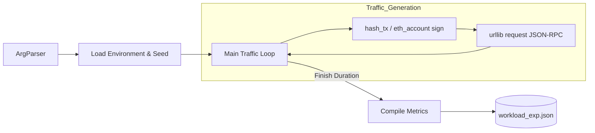
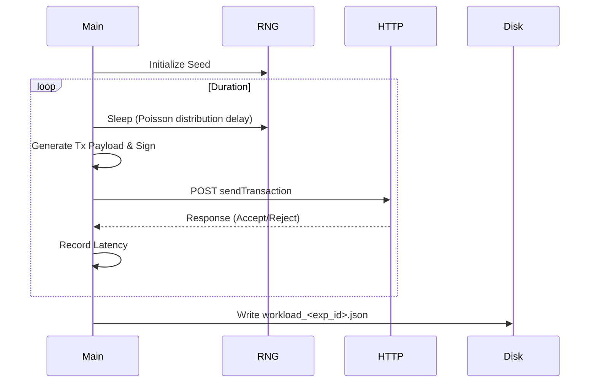

# Workload Generator / Benchmark Suite

## Workload Generator Abstract Architecture
**Purpose:** Show how the workload generator orchestrates tests.
**Evidence from code:** `benchmark-suite/README.md`, `benchmark-suite/workload/poisson_generator.py`

**Explanation:** The generator reads experiment configurations, blasts the Sequencer with synthetic HTTP traffic based on a Poisson distribution, and dumps the resulting telemetry into a local JSON file.

## Workload Generator Detailed Architecture
**Purpose:** Detail internal modules of the workload generator.
**Evidence from code:** `benchmark-suite/workload/poisson_generator.py`

**Explanation:** A synchronous python loop generates ECDSA-signed mock Ethereum transactions and sends them sequentially/concurrently via HTTP, calculating throughput and latency.

## Workload Generator Sequence Diagram
**Purpose:** Runtime behavior of the generator.
**Evidence from code:** `benchmark-suite/workload/poisson_generator.py`

**Explanation:** The core loop sleeps based on a mathematical distribution to simulate real-world arrival times before dispatching requests.
