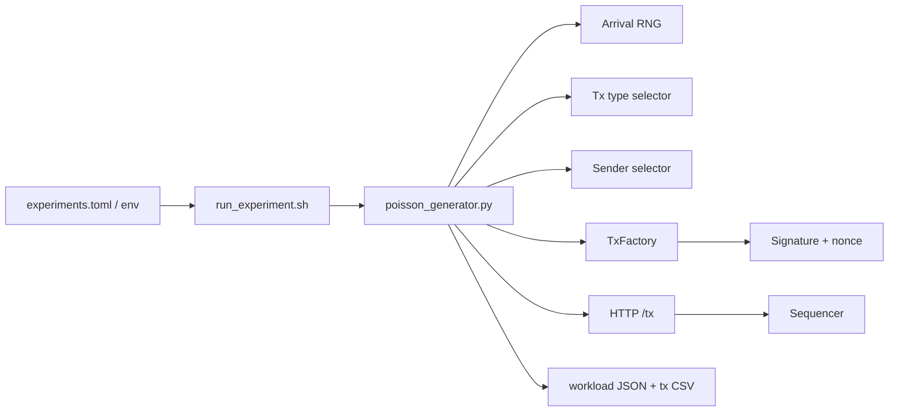

# Workload Generator

The workload generator drives system-level benchmarks by producing reproducible synthetic transaction streams and posting them to the sequencer.

## Architecture

Core files:

- `benchmark-suite/workload/poisson_generator.py`
- `benchmark-suite/workload/tx_types.py`
- `benchmark-suite/config/experiments.toml`
- `benchmark-suite/scripts/run_experiment.sh`

## Workload Controls

| Control | Meaning |
|---|---|
| `RATE_TPS` | Target Poisson arrival rate. |
| `DURATION_S` | Measured phase duration. |
| `WARMUP_S` | Warmup duration. |
| `WORKLOAD_TARGET_TXS` | Fixed-count burst mode when nonzero. |
| `WORKLOAD_CONCURRENCY` | Number of concurrent HTTP workers. |
| `WORKLOAD_ACCOUNT_COUNT` | Number of Hardhat-derived sender accounts. |
| `TX_MIX` | `balanced`, `light`, or `heavy`. |
| `SEED` | Reproducible RNG seed. |

## Transaction Types

| Type | Profile | Gas limit | Gas price | Extra calldata |
|---|---|---:|---:|---:|
| A | light transfer | 21,000 | 1 gwei | 0 bytes |
| B | medium | 65,000 | 2 gwei | 200 bytes |
| C | heavy | 200,000 | 3 gwei | 500 bytes |

Mix presets:

| Mix | A | B | C |
|---|---:|---:|---:|
| `balanced` | 70% | 20% | 10% |
| `light` | 95% | 4% | 1% |
| `heavy` | 20% | 30% | 50% |

## Sender and Nonce Correctness

The generator chooses `sender_index`, reads that sender's next nonce, and passes the same `sender_index` into `TxFactory.make`. `TxFactory` signs with the corresponding Hardhat private key and sets `from` to the matching address.

This avoids the previous validity risk where the logged sender/nonce could diverge from the actual signing account.

## Outputs

| File | Meaning |
|---|---|
| `workload_<experiment_id>.json` | Run-level workload summary. |
| `tx_log_<run_id>.csv` | Per-transaction status/error/latency and sender/nonce fields. |
| `run_status.json` | Pass/fail based on workload submission success. |

## Validity Notes

The workload is synthetic. It is good for controlled repeatable comparisons, but it is not a substitute for real L2 transaction traces. For fairness and nonce studies, use the multi-account experiments and inspect `sender_index`, `sender_nonce`, and rejection errors in the CSV.
