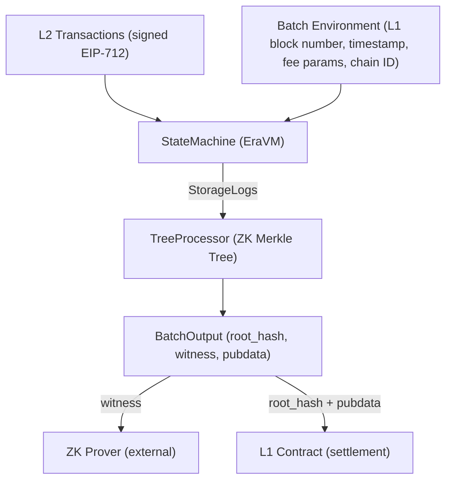
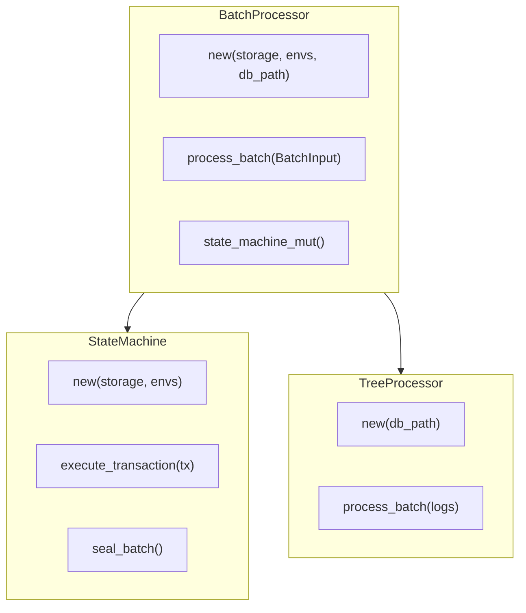
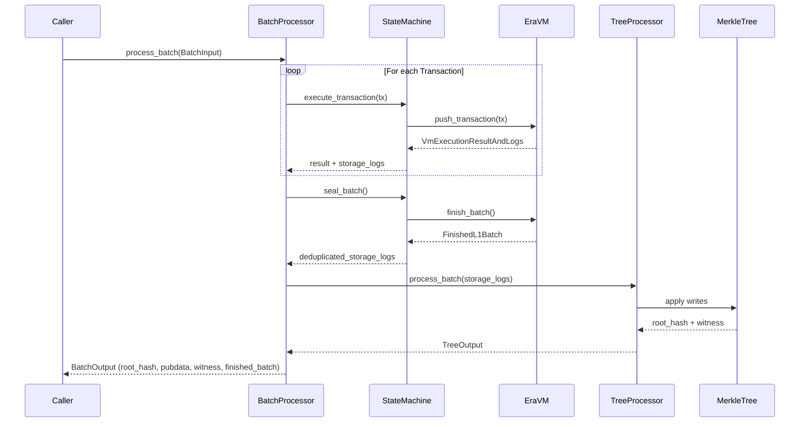
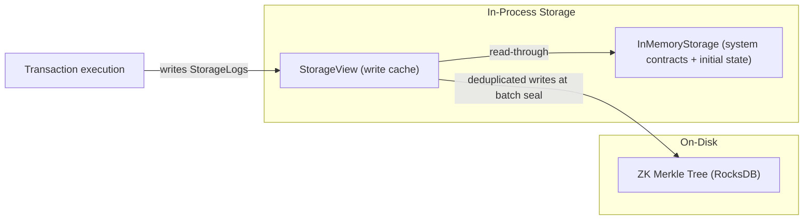
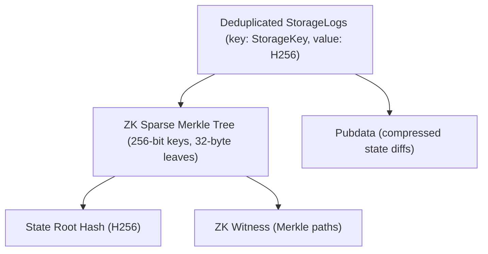
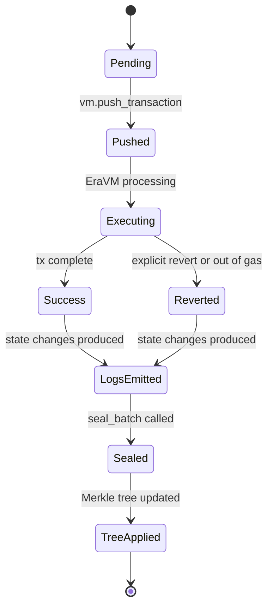
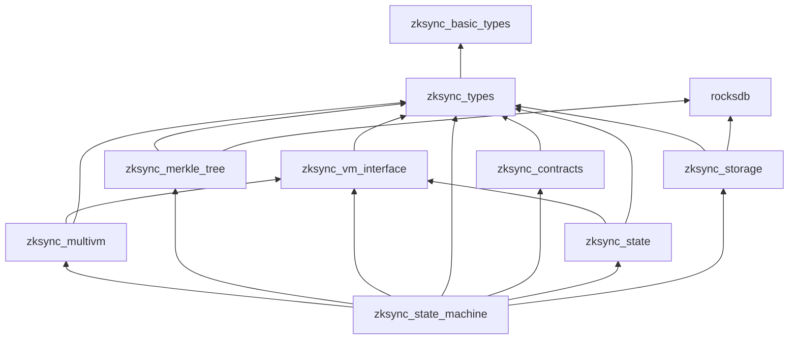
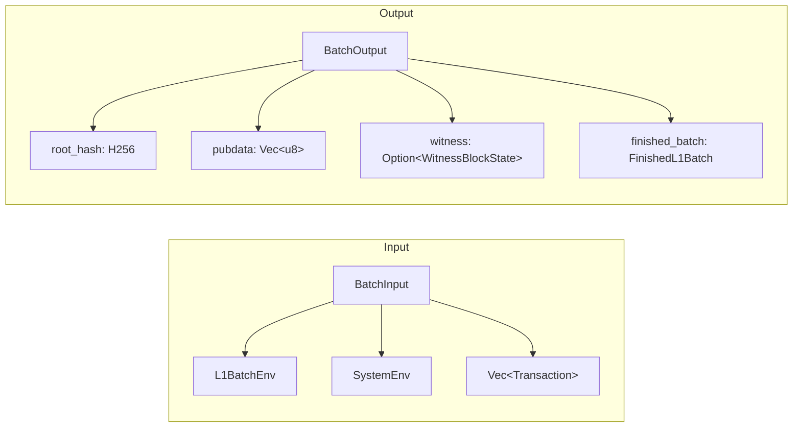

# System Design — Standalone ZKsync State Machine

This document describes the architecture, component responsibilities, and data flows of the standalone ZKsync state machine.

---

## Overview

The state machine implements one half of a ZK rollup: it **executes** a batch of L2 transactions through the ZKsync EraVM, writes the resulting state changes into a ZK Merkle tree, and produces the cryptographic outputs needed by a prover.

---

## Core Components

### 1. `BatchProcessor` (`executor.rs`)

Top-level orchestrator. Owns both the `StateMachine` and the `TreeProcessor`, and sequences their interaction for a full batch.

---

### 2. Batch Execution Flow

---

### 3. Storage Architecture

**`InMemoryStorage`** pre-loads all ZKsync system contracts (AccountCodeStorage, ContractDeployer, L1Messenger, etc.) on construction. It acts as the read-only base layer.

**`StorageView`** wraps the base storage and buffers every write during VM execution. At batch seal, these writes are deduplicated and forwarded to the Merkle tree.

---

### 4. Merkle Tree & Witness Generation

The Merkle tree uses a **sparse binary tree** with 256-bit keys (derived from `keccak(address, slot)`). Each batch application produces:

- **Root hash** — committed to L1 to prove state transition
- **Witness** — Merkle opening proofs fed to the ZK prover circuit
- **Pubdata** — compressed state diff posted to L1 for data availability

---

### 5. Transaction Lifecycle

---

### 6. Dependency Graph (Major Crates)

---

### 7. Key Data Structures

---

## Design Decisions

| Decision                        | Rationale                                                                                                      |
| ------------------------------- | -------------------------------------------------------------------------------------------------------------- |
| **Standalone workspace**        | Enables independent development and testing without the full 200+ crate monorepo                               |
| **`StorageView` write cache**   | Avoids partial tree writes mid-batch; all changes applied atomically at seal                                   |
| **RocksDB for the Merkle tree** | Proven key-value store, already used by ZKsync Era nodes in production                                         |
| **`LegacyVmInstance`**          | Pinned VM version matches the protocol version in the system contracts; ensures consistent execution semantics |
| **Local `svm-rs` patches**      | Minimal targeted fix to unblock the nightly-2025-03-19 toolchain without forking or upgrading upstream         |
