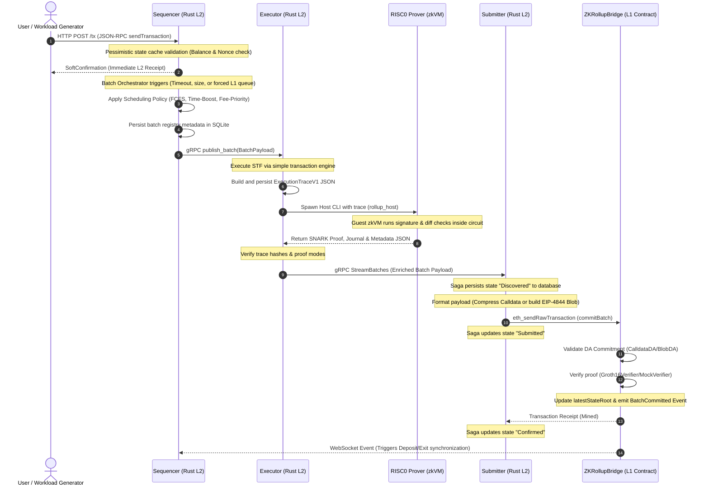

# RollupX Full System Design & Architecture

RollupX is a modular, high-throughput Layer-2 (L2) ZK-Rollup prototype. It is designed to evaluate custom transaction scheduling policies (e.g., FCFS, Time-Boost) and swappable data availability (DA) strategies (e.g., Calldata vs. EIP-4844 Blobs) under varied synthetic transaction workloads.

This document outlines the complete architectural design of the system, illustrating component interfaces, execution lifecycles, and cryptographic boundaries.

---

## 1. High-Level Architecture

The RollupX system is structured across three core logical boundaries:
1. **Client & Workload Generation Layer:** Initiates transaction streams.
2. **Layer 2 (L2) Rollup Node:** Handles transaction ordering, state execution, zero-knowledge proving, and L1 publication.
3. **Layer 1 (L1) Settlement Layer:** Validates proof correctness, ensures data availability, and anchors the canonical state root.

```mermaid
flowchart TB
    %% Styling
    classDef client fill:#e1f5fe,stroke:#03a9f4,stroke-width:2px;
    classDef l2 fill:#efebe9,stroke:#795548,stroke-width:2px;
    classDef prover fill:#ede7f6,stroke:#673ab7,stroke-width:2px;
    classDef l1 fill:#e8f5e9,stroke:#4caf50,stroke-width:2px;
    classDef obs fill:#fff3e0,stroke:#ff9800,stroke-width:2px;

    %% Nodes and connections for Client Layer
    subgraph Client_Layer["Traffic & UI Client Layer"]
        WG["Poisson Workload Generator<br/>(poisson_generator.py)"]:::client
        UI["Minimal dApp UI Dashboard<br/>(Next.js Frontend)"]:::client
    end

    %% Nodes and connections for L2 Sequencer
    subgraph Sequencer_Service["L2 Sequencer (Rust Microservice)"]
        RPC_API["JSON-RPC HTTP API Server<br/>(REST /tx)"]:::l2
        VAL["Validity Checker"]:::l2
        STATE_CACHE[("State Cache<br/>(Pessimistic Balance/Nonce)")]:::l2
        TX_POOL["Normal Transaction Pool"]:::l2
        L1_LST["L1 Event Listener<br/>(WebSocket Subscription)"]:::l2
        FORCED_Q["Forced Transaction Queue"]:::l2
        ORCH["Batch Orchestrator<br/>(Size, Timeout, or Forced Triggers)"]:::l2
        SCHED["Scheduling Engine<br/>(FCFS / TimeBoost / FeePriority)"]:::l2
        SEQ_DB[("SQLite Registry<br/>(sequencer.db)")]:::l2
        
        RPC_API --> VAL
        VAL --- STATE_CACHE
        VAL --> TX_POOL
        L1_LST --> FORCED_Q
        TX_POOL --> ORCH
        FORCED_Q --> ORCH
        ORCH --> SCHED
        SCHED --> SEQ_DB
    end

    %% Nodes and connections for L2 Executor
    subgraph Executor_Service["L2 Executor (Rust Microservice)"]
        EXEC_SVC["gRPC Executor Service<br/>(service.rs)"]:::l2
        TX_ENG["Simple Transaction Engine<br/>(STF Execution)"]:::l2
        ROCKS_DB[("RocksDB State Manager")]:::l2
        TRACE_STORE[("Trace Store<br/>(ExecutionTraceV1 JSON)")]:::l2
        INTEG_CHK["SHA-256 Integrity Checker"]:::l2
        
        EXEC_SVC --> TX_ENG
        TX_ENG --- ROCKS_DB
        TX_ENG --> TRACE_STORE
        TRACE_STORE --> INTEG_CHK
    end

    %% Nodes and connections for Prover Subsystem
    subgraph Prover_Subsystem["Prover Subsystem (RISC Zero zkVM)"]
        PROVER_HOST["RISC0 Host Prover<br/>(rollup_host binary)"]:::prover
        ZKVM["RISC0 zkVM Guest Execution<br/>(rollup_guest ELF)"]:::prover
        MOCK_PROV["Mock Proof Provider<br/>(Simulated Delay Option)"]:::prover
        
        PROVER_HOST --> ZKVM
    end

    %% Nodes and connections for L2 Submitter
    subgraph Submitter_Service["L2 Submitter (Rust Microservice)"]
        SUB_DAEMON["Submitter Daemon<br/>(daemon.rs)"]:::l2
        SAGA_ENG["Saga Workflow Engine<br/>(Discovered -> Proved -> Confirmed)"]:::l2
        SUB_DB[("Saga SQLite/Postgres DB")]:::l2
        CB["Circuit Breaker<br/>(Load Shedding/Backoff)"]:::l2
        DA_FORMAT["DA Formatter"]:::l2
        ZLIB["Zlib Compression<br/>(Calldata DA Mode)"]:::l2
        BLOB_FMT["Blob Formatter<br/>(EIP-4844 Blob DA Mode)"]:::l2
        ETH_ADAPTER["Ethereum Adapter<br/>(Web3 JSON-RPC Client)"]:::l2
        
        SUB_DAEMON --> SAGA_ENG
        SAGA_ENG --- SUB_DB
        SAGA_ENG --> CB
        SAGA_ENG --> DA_FORMAT
        DA_FORMAT -->|Calldata| ZLIB
        DA_FORMAT -->|EIP-4844| BLOB_FMT
        ZLIB --> ETH_ADAPTER
        BLOB_FMT --> ETH_ADAPTER
    end

    %% Nodes and connections for L1 Ethereum Layer
    subgraph L1_Settlement["Layer 1 Settlement & Data Availability"]
        BRIDGE["ZKRollupBridge.sol<br/>(L1 Smart Contract)"]:::l1
        DA_REG["IDAProvider Interface"]:::l1
        CALLDATA_DA["CalldataDA.sol"]:::l1
        BLOB_DA["BlobDA.sol"]:::l1
        VERIF_REG["IVerifier Registry"]:::l1
        GROTH16_VER["Groth16Verifier.sol"]:::l1
        MOCK_VER["MockVerifier.sol"]:::l1
        
        BRIDGE --> DA_REG
        DA_REG -.->|Implements| CALLDATA_DA
        DA_REG -.->|Implements| BLOB_DA
        BRIDGE --> VERIF_REG
        VERIF_REG -.->|Implements| GROTH16_VER
        VERIF_REG -.->|Implements| MOCK_VER
    end

    %% Nodes and connections for Observability & Benchmarking
    subgraph Benchmarking_Observability["Orchestration & Observability Suite"]
        ORCH_SCRIPT["Benchmark Orchestrator<br/>(run_experiment.sh)"]:::obs
        METRICS_DIR[("Metrics Repository<br/>(JSONL files: seq, exec, sub)")]:::obs
        DATA_TOOLS["Data Tools & Analytics<br/>(Python / Pandas / Matplotlib)"]:::obs
    end

    %% Cross-Component Connections
    WG -->|HTTP POST /tx| RPC_API
    UI -->|HTTP POST /tx| RPC_API
    
    SCHED -->|gRPC: publish_batch| EXEC_SVC
    
    INTEG_CHK -->|Invoke Host CLI| PROVER_HOST
    ZKVM -->|Proof Artifacts| INTEGRITY_PASS["Verified Artifacts<br/>(proof.bin, journal.bin, meta.json)"]:::prover
    INTEGRITY_PASS --> EXEC_SVC
    
    EXEC_SVC -->|gRPC Stream: StreamBatches| SUB_DAEMON
    
    CB -->|HTTP POST /prove| MOCK_PROV
    MOCK_PROV -->|Mock Proof| SAGA_ENG
    
    ETH_ADAPTER -->|eth_sendRawTransaction| BRIDGE
    
    BRIDGE -.->|L1 Events (Deposit/Force)| L1_LST
    
    %% Metrics pipelines
    RPC_API -.->|Writes telemetry| METRICS_DIR
    EXEC_SVC -.->|Writes telemetry| METRICS_DIR
    SUB_DAEMON -.->|Writes telemetry| METRICS_DIR
    ORCH_SCRIPT -.->|Manages config & logs| METRICS_DIR
    METRICS_DIR -.->|Reads for visualization| DATA_TOOLS
```

---

## 2. Component Architecture Deep-Dive

### 2.1 The Sequencer (`sequencer/`)
The Sequencer is a high-performance transaction ingestion and scheduling service. It operates asynchronously to isolate instant transaction receipts from batch construction overhead.

*   **Pessimistic State Cache:** To support high throughput, the Sequencer maintains a fast, in-memory cache of account balances and nonces. When transactions arrive via JSON-RPC, they are validated against this cache instead of full state database queries. Valid transactions result in an immediate `SoftConfirmation`.
*   **Forced Transaction Ingestion:** A background listener monitors the L1 `ZKRollupBridge.sol` contract for L1-initiated events (such as deposits or emergency escape transactions). These bypass the standard mempool and enter the high-priority `ForcedQueue`.
*   **Strategy Pattern Scheduling:** The `BatchOrchestrator` triggers batch sealing based on configured limits (batch size, max timeout, or forced L1 transactions). Once triggered, it applies the active scheduling policy:
    *   *First-Come-First-Served (FCFS):* Orders transactions strictly by their ingestion timestamp.
    *   *Time-Boost:* Mimics a priority auction with scheduling adjustments.
    *   *Fee-Priority:* Orders transactions strictly by transaction gas tips.
*   **Database Registry:** SQLite is used as a local persistent registry to log sealed batch details, transactions contained, and scheduling metadata.

### 2.2 The Executor (`executor/`)
The Executor functions as the L2 State Transition Function (STF) engine and ZK proving coordinator.

*   **State Transition Engine (STF):** When a batch payload is received from the Sequencer via gRPC, the Executor normalizes and executes the transactions sequentially using a simplified transaction engine (`SimpleTransactionEngine`) over `RocksDbStateManager`.
*   **Trace Extraction:** Execution results in a detailed `ExecutionTraceV1` containing state diffs, public inputs, and transaction outcomes. This trace is persisted and its SHA-256 hash is immediately verified to guarantee integrity.
*   **RISC Zero Prover Integration (`risc0_prover/`):** 
    *   *Guest Program (`guest/`):* A lightweight execution verifier compiled into a RISC-V ELF. It reads the execution trace, processes state diffs, validates signatures, and commits to the `(initial_state_root, final_state_root)` inside the zkVM.
    *   *Host Program (`host/`):* Spawns the guest zkVM, executing the guest program and compressing the receipt into a SNARK proof (using Groth16).
*   **Publication:** Once proving succeeds, the Executor bundles the state update, the proof artifacts, and the DA commitment into an enriched payload and broadcasts it over a gRPC stream.
*   *Note on Pass-Through Mode:* In standard benchmarking mode (`EXECUTOR_MODE=grpc`), the executor operates as a stateless gRPC pass-through relay to eliminate proof-generation delays and evaluate networking throughput.

### 2.3 The Submitter (`submitter/`)
The Submitter ensures reliable batch delivery and data availability settlement on the L1 blockchain.

*   **Hexagonal Architecture:** The Submitter isolates core domain logic (Saga state management) from external infrastructure dependencies (gRPC clients, databases, Ethereum RPC adapters).
*   **Saga Workflow Pattern:** A robust state machine tracks batch states:
    $$\text{Discovered} \longrightarrow \text{Proved} \longrightarrow \text{Submitted to L1} \longrightarrow \text{Confirmed on L1}$$
    If the daemon crashes mid-flight, the Saga workflow resumes from the exact state saved in the local SQLite/Postgres tracking database.
*   **Circuit Breaker & Load Shedding:** A circuit breaker monitors prover latency. If the prover latency spikes or fails repeatedly, the circuit trips to protect the node from resource exhaustion, buffering batches locally.
*   **Dynamic DA Formatter:** Depending on configuration, the Submitter formats the transaction payloads:
    *   *Calldata:* Formats the transactions, applies Zlib compression, and sends it via standard Ethereum transaction calldata.
    *   *Blob (EIP-4844):* Packages the payload into EIP-4844 blobs, computing KZG commitments.

### 2.4 L1 Settlement Contracts (`contracts/`)
The Layer 1 Solidity contracts act as the source of truth and the arbitration layer for RollupX.

*   **ZKRollupBridge (`ZKRollupBridge.sol`):** The main entry contract. It exposes `commitBatch()`, which orchestrates validation.
*   **Modular DA Interface (`IDAProvider.sol`):** A swappable interface allowing the bridge to validate DA commitments.
    *   `CalldataDA.sol`: Validates that the transaction data has been properly submitted in Ethereum calldata.
    *   `BlobDA.sol`: Validates EIP-4844 KZG commitments.
*   **Verifier Registry (`IVerifier.sol`):** Verifies cryptographic proofs.
    *   `Groth16Verifier.sol`: Validates the actual RISC Zero Groth16 SNARK proof.
    *   `MockVerifier.sol`: Hardhat test helper that bypasses proof execution, returning `true` to facilitate rapid testing of non-cryptographic rollup dynamics.

---

## 3. End-to-End Data and Control Flow

The diagram below illustrates the chronological timeline of a transaction, showing how it moves from client generation to L1 block inclusion.



---

## 4. Observability and Benchmarking Framework

A major component of the RollupX system is its extensive metrics instrumentation. This framework is designed to collect telemetry from all services during an experiment run to generate comparative performance statistics.

*   **Experiment Orchestrator (`run_experiment.sh`):** Automates configuration matrix testing. It:
    1. Generates custom configurations for Sequencer scheduler policies.
    2. Spawns backend processes.
    3. Runs the Poisson Workload Generator.
    4. Polls output files until the metrics have stabilized (i.e., all L2-sequenced batches are settled on L1).
*   **Data Tools (`data-tools/`):** Aggregates telemetry across files (`sequencer_batches_<exp>.jsonl`, `executor_metrics.jsonl`, and `submitter_metrics.json`). It validates metrics integrity across components using the unique `batch_id` and `experiment_id` correlation handles, exporting Pareto frontiers, CDF latency distributions, and throughput bars.
